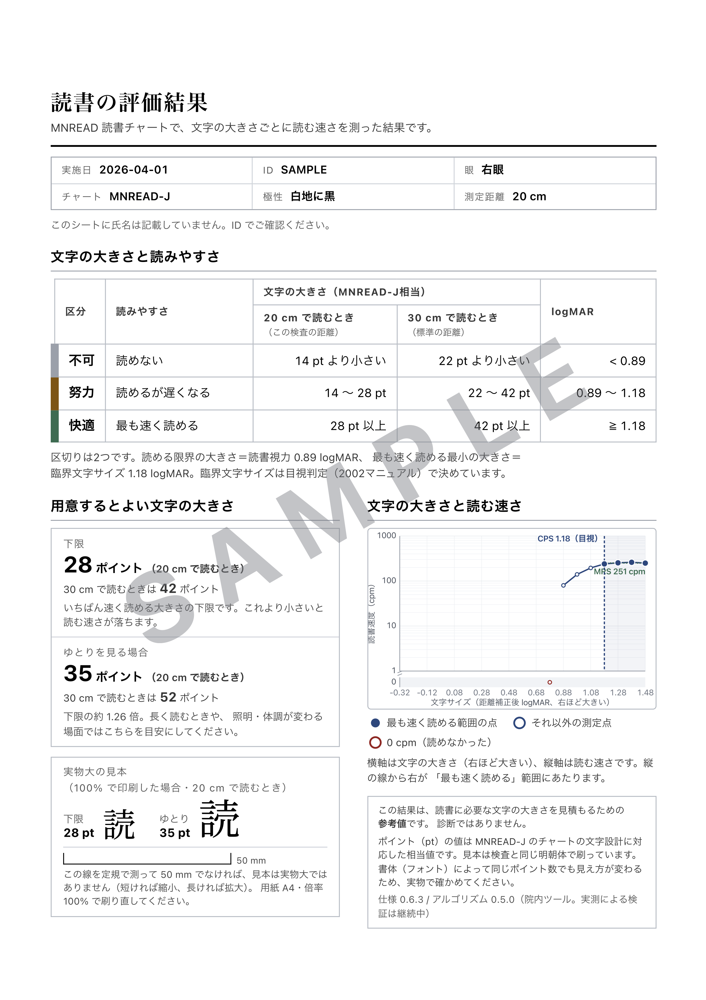

# MNREAD-J / MNREAD-Jk 読書チャート解析

眼科診療所で使う、ブラウザ完結の MNREAD-J / MNREAD-Jk 解析ツール。視能訓練士が検査をしながら
行ごとの読書時間と読み損じ文字数を打ち込むと、読書視力（RA）・最大読書速度（MRS）・
臨界文字サイズ（CPS）を算出し、電子カルテ用の定型文と、患者・支援者に渡す A4 レポートを出す。

**患者データは端末から出ない。** 保存もしない。データが外に出る経路は、検者が明示的に実行する
ファイル書き出しだけである。公開版はアクセス数を数えるビーコン1本（Cookie なし・入力値を含まない）
だけを持ち、CSP はその2ホストのみを許して残りを塞ぐ（ADR-0017）。

- 動くもの: <https://yamaguchitoshi.github.io/mnread/>
- 仕様版 0.6.2 / アルゴリズム版 0.5.0（画面と全出力に表示される）
- **実測検証中（Phase 5）。** 臨床判断に用いる前に下記「いまの状態」を読むこと

---

## いまの状態

| | |
|---|---|
| 実装 | Phase 0〜4 完了。Phase 5（実測検証）進行中 |
| テスト | 557件（`packages/core` 378 / `apps/web` 179）すべて通過 |
| 一次資料との照合 | ポイント換算・距離補正・小数視力・速度表・§4 測定例のすべてが一致（`pnpm verify:fixtures`）|
| 未解決事項 | SPEC §11 に 5件（OPEN-2 / 4 / 5 / 6 / 7）。いずれも実測がないと決められない |
| 検索エンジン | `noindex`。検証が終わるまで検索結果に載せない |

**まだ臨床の主値として自動値を採らないこと。** CPS の臨床的な主値は検者の目視判定であり
（ADR-0006）、自動推定は併記の参考値である。画面には検証状況を示す帯が常設されており、
消すことはできない。

---

## 何ができるか

3つの画面からなる。

**入力** — 19行のスコアシート。テンキーだけで打ち切れる（`Enter` で次行、`+` で誤り数、
`*` で不読、`/` で状態メニュー）。打った行から順に cpm と曲線が伸びる。不正な入力は
その場で赤く出し、黙って丸めたり埋めたりしない。

**判定** — 曲線上でプラトーの点を選ぶ。CPS と MRS はその選択から導かれる値であり、
独立に動かすつまみは設けていない（ADR-0012）。自動値との差異、除外した点とその理由、
上書きの理由が監査記録として残る。原典 図3 に相当する読書時間の副グラフも出る。

**出力** — 電子カルテ用テキスト、A4 レポート（判読3ゾーン・推奨文字サイズ・実物大の
文字見本・速度曲線）、JSON / CSV 書き出しと JSON 読み込み。書き出した JSON は
プラトーの選択まで含むので、読み込めば判定込みで再現できる。

患者・支援者に渡す A4 レポートは、こう出る。



図の紙面は**合成データによる見本**であり、実測記録でも原典の測定例でもない（透かしはそれを
示すもので、開発ビルドの `?sample` が見本データと一緒に付ける。公開版には出ない）。
1枚に収める版組と、紙の上で実物大になることは、目視ではなく実測で確かめている——
版面 180.09 mm（設計 180 mm）、校正目盛り 49.95 mm（設計 50 mm）。左下の 50 mm 目盛りは
受け取った側が縮小印刷を見抜くためのもので、実物大の文字見本を渡す前提そのものである。

---

## 設計の要点

詳細と経緯は `docs/adr/`（17件）にある。とくに効いているもの:

- **計算は core だけが行う**（ADR-0010）。画面に出る数値は単位換算や推奨サイズも含め、
  すべて `@mnread/core` の返り値である。「表示用だから」で UI 側に計算を書かない
- **内部で丸めない**（ADR-0003）。倍精度のまま持ち、表示の直前だけ丸める
- **不正入力は拒否する**（ADR-0004）。`errors > n0`、`t ≤ 0`、負の距離はデータではなく誤りである
- **0 cpm と欠測は違う**（ADR-0002）。0 cpm は測定された事実で曲線に載る。項目の状態は6値の列挙
- **CPS は算出法IDを伴わなければ結果ではない**（ADR-0006）。「CPS = 0.6 logMAR」だけの行を
  画面・カルテ文・書き出しのいずれにも出さない
- **MRS は3値を出す**（ADR-0005）。原典は定義本文と計算例が食い違っており、実装が黙って
  片側を選ばない。原典の測定例では 412 / 411 / 411 cpm に分かれ、原典が本文に書いた値は 411
- **英語版の定数を日本語版に持ち込まない**（ADR-0001）。10語でも 40cm でも 200 wpm でもない
- **過剰に警告する側に倒す。** 誤った自動 CPS が黙ってカルテに載るより、余計な目視確認の
  ほうが安い。合成600本で「無警告のまま外れる」がゼロであることを、**出荷される構成で**
  検証している（ADR-0015）

---

## どう検証しているか

### 一次資料に対する数値照合

`oda.lab/` の公式マニュアルと Q&A から転記したゴールデンデータに対して、`pnpm verify:fixtures`
が独立の参照式で照合する（core を import しない — 実装の誤りが同じ誤りの転記を承認しないため）。

| 照合 | 結果 |
|---|---|
| ポイント換算 vs Q&A A4.3 の9桁表（21件）| 最大相対誤差 2.8×10⁻⁹ |
| 距離補正・M値 vs マニュアル表A（33件）| 原典の2桁丸めのうえで完全一致 |
| 小数視力 vs 表B、読書速度 vs 表C | 丸めのうえで完全一致 |
| マニュアル §4 の測定例（19行すべて）| RA・CPS・MRS・M値が原典の記載値を再現 |

### 合成曲線 600本（15族 × 40本）

真値が既知の曲線を生成し、CPS の復元と警告の発火を測る。**最重要の基準は精度ではなく、
「誤った CPS を無警告で出さない」がゼロであること。** 出荷される既定構成と、算出法を
4つ有効にした構成の両方で課している。

現状: 完全一致 498 / ±0.1 logMAR 以内 527 / 無警告の誤り **0**。

### 変異テスト

テストが通ることは、設計判断が効いていることの証拠にならない。定数や符号を意図的に壊して
失敗を確認する。プラトー探索については11件の変異（1.96 の係数、ばらつきの下限、核の同値処理、
欠測段の扱い、最速点の除外、不動点の要求ほか）すべてが検出される。

### `mnreadR` 2.1.7 との照合

英語版 MNREAD の作者らによる R 実装と突き合わせた（`docs/mnreadr-comparison.md`）。
**一致を目標にしていない** — `mnreadR` は照合対象であって裁定者ではなく、合わせにいくと
日本語版マニュアルが自分で書いた値から離れることがある（ADR-0014）。

結果、**`mnreadR` に合わせるべき差異は1件もなかった**。一方で照合がなければ見つからなかった
実在の欠陥が2件出て、どちらも修正済みである。

- 単一の高い外れ値が帯を過大にし、CPS を過小評価していた（ADR-0016）
- 出荷される構成が受け入れテストの構成より弱く、警告が1本すり抜けていた（ADR-0015）

---

## 開発

```
pnpm install
pnpm typecheck          # 全パッケージ
pnpm test               # 全パッケージ（Vitest）
pnpm verify:fixtures    # 転記したゴールデンデータを参照式で検証

pnpm --filter @mnread/web dev     # 開発サーバ（/mnread/ で配信）
pnpm --filter @mnread/core diff:mnreadr   # mnreadR との差異レポート
```

Node 22以上、pnpm ワークスペース。`packages/core` は TypeScript のまま読み込むのでビルド不要。

```
oda.lab/           一次資料（公式マニュアル・Q&A の PDF）
packages/core/     計算コア。純粋関数のみ。DOM・日付・乱数・ロケールに依存しない
packages/fixtures/ 一次資料から転記したゴールデンデータと、独立した検証スクリプト
apps/web/          React + 自前SVG。アセットは全部バンドルし、CDN から取らない
```

`main` への push は、型チェック・転記検証・全テストを通ったものだけが GitHub Pages に配信される。
臨床値を出すツールであり、速く配ることより壊れた計算を配らないことを優先する。

---

## 残っていること

**Phase 5（実測検証）** — 開発側の手元だけでは進まない。記録も、目視 CPS も、患者向け文言の
可否も臨床側にしかない。

- 過去20〜30例を手計算または MNJA と突き合わせる
- ORT 2〜3名による目視 CPS との一致確認、同一記録の二重入力
- 暫定の閾値を実測で較正する（OPEN-4 / 6 / 7）
- **患者・支援者に渡る文言と、カルテ定型文の監修**（`docs/review-request.md` が依頼文）

受け入れの線引きは「一致率が何%」ではなく、**乖離した例をすべて説明できること**である。

**Phase 6** — PWA / オフライン動作の確認。うち2件（版と検証状況の明示、既知の限界の常設）は
公開の時点で必要になるため前倒しで実装済み。

---

## ドキュメントの地図

| 読むもの | いつ |
|---|---|
| `SPEC.md` | 計算に関わることすべて。**実装と食い違ったら SPEC が正**。式には原典の参照箇所が付く |
| `docs/adr/` | 「なぜこうなっているのか」。一見おかしく見える箇所の多くは意図的である |
| `PLAN.md` | フェーズごとの計画と達成状況 |
| `docs/mnreadr-comparison.md` | `mnreadR` との差異と、その一件ごとの裁定 |
| `docs/review-request.md` | 臨床側に渡す監修依頼 |
| `CLAUDE.md` | Claude Code で作業するときの規約 |
| `oda.lab/` | 一次資料。式の疑義は調査報告ではなくここに当たる |

---

## 位置づけ

自施設内での測定値の計算・表示に用いる院内ツールであり、**診断・治療の判断を行わない**。
推奨倍率・推奨文字サイズは参考値である。ポイント換算値は MNREAD-J のチャートの文字設計に
対応した相当値であり、書体によって同じポイント数でも見え方が変わる。
