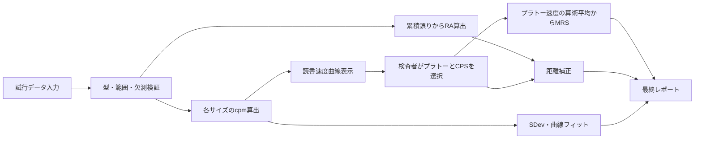

# MNREAD-J／MNREAD-Jk解析のための算出式・自動推定アルゴリズム実装仕様

## Executive Summary

MNREAD-J／MNREAD-Jkの解析実装では、**日本語版公式マニュアルに準拠した「従来法」と、自動化・再現性を高める「曲線推定法」を分離して実装する**のが最も妥当である。

日本語版公式マニュアルから確定できる中核式は、次のとおりである。

\[
v_i=\frac{n_0-e_i}{t_i}\times60
\]

ここで、MNREAD-Jは \(n_0=30\)、MNREAD-Jkは \(n_0=24\)、\(e_i\) は読み損じ文字数、\(t_i\) は秒単位の読書時間、\(v_i\) は文字／分（cpm）である。全文字を読み損じた場合は0 cpmとする。citeturn16view1

読書視力（RA）は、標準チャートについて次式で算出する。

\[
RA_J=1.4-0.1N+\frac{E}{300}
\]

\[
RA_{Jk}=1.4-0.1N+\frac{E}{240}
\]

\(N\) は最上段から数えた「読んだ、または読もうとした読み材料数」、\(E\) は累積読み損じ文字数である。30 cm以外で測定した場合は、RAおよびCPSに

\[
\Delta L=\log_{10}\left(\frac{30}{D}\right)
\]

を加える。\(D\) は実測距離cmである。citeturn17view0turn16view6

CPSは、公式マニュアル上は「最大読書速度で読める最小文字サイズ」であり、読書速度曲線が低下し始める直前の文字サイズをグラフから判定する。MRSは、CPS以上の文字サイズにおける読書速度の平均である。citeturn16view1turn16view2

ただし、MRSには公式資料内の軽微な不整合がある。定義本文は「各文字サイズの読書速度の平均」を求めるとしているが、計算例は「読書時間を平均してから速度に換算」している。したがって、実装では、**定義に忠実な算術平均を標準値とし、計算例互換値を別フィールドで出力できるようにする**のが望ましい。citeturn16view2turn17view1

自動CPS推定について、MNREAD文献で主要な方法として確認できたのは、プラトーを探索する標準偏差法、two-limbモデル、negative exponential decayモデルおよびNLMEである。Weibull関数は一般的な心理測定・読書速度モデルとして実装可能だが、今回確認したMNREAD公式資料・主要原著論文では、MNREADチャートの標準採点モデルとしては位置づけられていない。したがって、Weibullは「実験的感度分析」と明記し、標準出力には用いないことを推奨する。citeturn18view6turn18view7turn19view0turn20view5

ACCは英語MNREADについて、

\[
ACC=\frac{\text{1.3～0.4 logMARの10速度の平均}}{200\ \mathrm{wpm}}
\]

と定義される。分母200 wpmは英語母語話者の若年正常視群から得られた正規化定数であり、日本語cpmにそのまま適用してはならない。日本語版では、当面「ACC対象範囲の平均cpm」を非正規化値として出力し、日本語版の基準値が確立するまで `ACC-J` 等の名称で正規化しないことを推奨する。citeturn18view4turn18view5turn20view0

ポイント換算には、小田研究室Q&Aに公式のMNREAD-J換算式がある。30 cm条件では、

\[
pt_{30}(L)
=
1908\tan\left(
10^L\frac{5}{60}\frac{\pi}{180}
\right)
\]

であり、例えば0.6 logMARは約11.05 pt、1.0 logMARは約27.75 ptである。これはMNREAD-Jの文字設計・明朝体に対応する換算で、任意のWordフォントにおける実際の字面高と完全に一致する値ではない。citeturn16view8turn17view3turn17view4

## 根拠資料と適用範囲

本仕様で優先した資料は、以下の順である。

| 情報源 | 本仕様で採用する範囲 | 出典箇所・リンク |
|---|---|---|
| 小田ら『MNREAD-J, Jk Manual』 | J／Jkの文字数、cpm、RA、CPS、MRS、距離補正、M値、実施条件、MNJAの注意事項 | §2～§5、表A、pp.3–10。citeturn16view0turn16view1turn16view2turn17view0turn16view5turn16view6 |
| 小田研究室 MNREAD-J Q&A | logMARから視角・ポイント・M値への換算、自己訂正や改行誤りの採点 | Q4.1～Q7、Q9。citeturn16view7turn16view8turn17view3turn17view5turn16view9 |
| University of Minnesota公式 | 現行英語MNREADのRA、wpm、CPS、MRS、40 cm条件 | Reading Measures、Setup。citeturn18view0turn18view1turn18view2turn18view3 |
| Calabrèse et al., 2016 | ACCの定義、正規化定数、欠測値処理 | JAMA Ophthalmology、MethodsおよびFigure 1。citeturn18view4turn18view5turn20view0 |
| Cheung et al., 2008 | two-limb、negative exponential、NLME、CPS閾値 | IOVS、MethodsおよびDiscussion。citeturn19view0turn20view5turn20view6turn20view7 |
| Calabrèse et al., 2019 | 目視評価の評定者間差、SDev法、NLME閾値比較 | PLOS ONE、Algorithms、Discussion。citeturn18view6turn18view7turn20view2turn20view4 |
| mnreadR | SDev法、RA、ACC、NLMEの参照実装候補 | GitHubミラー、パッケージ文書。CRANでは2025年10月にアーカイブされているため、依存ライブラリとしてではなく参照コードとして固定・検証するのが安全である。citeturn21search2turn21search4turn21search6turn21search21 |
| MNJA／MNREAD iPadアプリ | 既存ソフトの入出力・表示機能の確認 | MNJAは時間、誤り、距離から自動算出するが内部式・丸め規則は公開資料から確認できない。iPadアプリも曲線フィッティング機能を持つが、App Store記載では内部アルゴリズムは示されていない。citeturn16view5turn15search2 |

### 情報源別の算出式と差異

| 項目 | MNREAD-J | MNREAD-Jk | 現行英語MNREAD | 自動推定文献 |
|---|---|---|---|---|
| 一読み材料の単位 | 30文字 | 24文字 | 60文字＝10標準語 | 入力された各サイズの速度 |
| 読書速度 | \(60(30-e)/t\) cpm | \(60(24-e)/t\) cpm | \(60(10-e)/t\) wpm | 正速度を線形・対数空間でモデル化 |
| 全誤り | 30文字誤りで0 cpm | 24文字誤りで0 cpm | 10語以上の誤りで0 wpm | 0速度は対数変換不能 |
| RA | \(1.4-0.1N+E/300\) | \(1.4-0.1N+E/240\) | 最小試行サイズ \(+0.01E_{\rm word}\) | 通常は直接採点し、曲線推定しない |
| CPS | 速度低下直前の最小サイズ | 同左 | 最大速度を支持する最小サイズ | SDev、two-limb、negative exponential＋閾値 |
| MRS | CPS以上の速度平均 | 同左 | CPSより大きい文字での速度 | プラトー平均または漸近速度 |
| ACC | 公式の日本語正規化式なし | 同左 | 1.3～0.4の平均wpm÷200 | mnreadRに実装あり |
| 標準距離 | 30 cm | 30 cm | 40 cm | 補正済みlogMARを使用 |
| 距離補正 | \(+\log_{10}(30/D)\) | 同左 | 40 cm基準の補正表 | 標準距離をパラメータ化 |
| 主な出典 | 公式マニュアル §3。citeturn16view1turn17view0 | 同左 | UMN Reading Measures。citeturn18view0turn18view1 | Cheung、PLOS、mnreadR。citeturn20view5turn20view2turn21search21 |

MNREAD-JとJkは同じ解析枠組みを持つが、刺激材料が異なるため結果を同一尺度として無条件に交換できない。公式マニュアルでは、正常成人でJのMRSが約10％速く、JkのRAが約0.05 logMAR良かった例、別の条件ではJkのCPS・RAが約0.1 logMAR良かった例が記載されている。JkのCPSから漢字かな交じり文の支援倍率を考える場合には、約0.1 logMAR、すなわち約26％の余裕を持たせることが提案されている。citeturn16view4

小児のJk成績、とくにMRSは、視覚機能だけでなく年齢、学習経験、語彙、音読・構音能力の影響を受ける。したがって、JkのMRSを視覚機能だけの指標として解釈せず、年齢群、検査言語、チャート極性、音読条件をメタデータとして保存すべきである。citeturn14search6

## 指標別の算出仕様

### 共通入力データ

解析エンジンには、最低限次のフィールドを与える。

| フィールド | 型・単位 | 必須条件 |
|---|---|---|
| `test_type` | enum | `MNREAD-J`、`MNREAD-Jk`、`MNREAD-English` |
| `chart_version` | string | チャート版・アプリ版を識別 |
| `print_logmar_label` | decimal logMAR | チャートに印刷された値 |
| `reading_time_sec` | 正の実数、秒 | J/Jkでは原記録は0.1秒精度 |
| `error_count` | 非負整数 | J/Jkは文字数、英語版は語数 |
| `attempted` | boolean | 試行済みと未測定を区別 |
| `viewing_distance_cm` | 正の実数、cm | 原則として試行中一定 |
| `standard_distance_cm` | 30または40 | J/Jkは30、現行英語版は40 |
| `polarity` | enum | 黒文字／白背景、白文字／黒背景 |
| `eye_condition` | string | 右眼、左眼、両眼、矯正条件等 |
| `notes` | string | 行飛ばし、自己訂正、視距離変動等 |

MNREAD-J/Jk公式マニュアルでは、白背景輝度は最低80 cd/m²、標準距離は30 cmで、測定距離に合わせた屈折矯正を行う。現行University of Minnesotaの英語チャートでは、白背景100 cd/m²、標準距離40 cmが示されている。両者を一つの固定条件に統合せず、チャート別の標準距離と測定条件を保持する必要がある。citeturn16view0turn18view3

### 読書速度

各文字サイズ \(i\) について、

\[
c_i=n_0-e_i
\]

\[
v_i=\frac{60c_i}{t_i}
\]

とする。

MNREAD-Jでは、

\[
n_0=30,\qquad
v_i=\frac{60(30-e_i)}{t_i}\ {\rm cpm}
\]

MNREAD-Jkでは、

\[
n_0=24,\qquad
v_i=\frac{60(24-e_i)}{t_i}\ {\rm cpm}
\]

である。出典箇所は公式マニュアル §3.1、pp.4–5である。citeturn16view1

現行英語MNREADは10標準語を一文とし、

\[
v_i=\frac{60(10-e_i)}{t_i}\ {\rm wpm}
\]

となる。誤りがなければ \(600/t_i\) である。citeturn18view1turn18view2

実装では次の条件を課す。

\[
0\le e_i\le n_0,\qquad t_i>0
\]

\[
e_i=n_0 \Longrightarrow v_i=0
\]

`error_count > n0` は入力エラーとし、黙って0へ丸めない。未試行は0 cpmではなく欠測値とする。公式マニュアルは全文字を読み損じた試行を0 cpmとしているが、未測定行について0 cpmとは定義していない。citeturn16view1

途中で自己訂正して正しく読み直した文字は誤りに数えず、訂正に要した時間は読書時間に含める。行を丸ごと飛ばした場合、MNREAD-Jでは10文字の誤りとして扱う。同じ行を読み直して正しく読めた場合は誤りに数えないが、読み直し時間を含める。citeturn16view9

単体テスト例は次のとおりである。

\[
t=5.0,\ e=2,\ n_0=30
\]

\[
v=60\frac{28}{5}=336\ {\rm cpm}
\]

MNREAD-Jkで \(t=6.0,\ e=0\) なら、

\[
v=60\frac{24}{6}=240\ {\rm cpm}
\]

となる。

### 読書視力

MNREAD-Jの公式式は、

\[
RA_{\rm label}
=
1.4-0.1N+\frac{E}{300}
\]

MNREAD-Jkは、

\[
RA_{\rm label}
=
1.4-0.1N+\frac{E}{240}
\]

である。出典箇所は公式マニュアル §3.4、p.5である。citeturn17view0

ここで、

- \(N\)：最上段から数えた、読んだ、または読もうとした読み材料数
- \(E\)：対象範囲における累積読み損じ文字数
- 上段を省略して途中から開始した場合、省略した上段は正しく読めたものとして \(N\) に含め、誤り0とする
- 最後に全文字を読めなかった材料も、試行したなら \(N\) と累積誤りに含める

と解釈する。公式手順は、大きい文字から小さい文字へ進み、読める文字がなくなるまで試行することを前提としている。citeturn1view0turn17view1

より一般化すると、チャート刻みを \(h=0.1\)、最後に試行した行の表示サイズを \(L_{\min}\) として、

\[
RA_{\rm label}
=
L_{\min}+\frac{hE}{n_0}
\]

と書ける。

MNREAD-Jでは \(h/n_0=0.1/30=1/300\)、Jkでは \(0.1/24=1/240\) である。上端1.3 logMARの標準チャートでは、

\[
L_{\min}=1.4-0.1N
\]

となるため、公式式と一致する。この一般式を用いれば、将来チャートの上端や刻みが変わっても対応できる。

距離補正後のRAは、

\[
RA_{\rm corrected}
=
RA_{\rm label}
+
\log_{10}\left(\frac{30}{D}\right)
\]

である。citeturn16view6

公式計算例では、MNREAD-J、\(N=8\)、\(E=59\)、測定距離15 cmなので、

\[
RA_{\rm label}
=
1.4-0.8+\frac{59}{300}
=
0.796\overline{6}
\]

\[
RA_{\rm corrected}
=
0.796\overline{6}+\log_{10}(2)
=
1.0977
\]

となる。マニュアルは途中を0.2に丸めて0.8、さらに距離補正後を1.1 logMARと記載している。citeturn17view1turn17view2

この例から、公式マニュアルには表示上の丸めはあるものの、**明示的な一般丸め規則はない**。実装では内部値を丸めず、少なくとも倍精度で保持し、次のように分離することを推奨する。

| フィールド | 推奨表示 |
|---|---|
| `ra_logmar_raw` | 内部フル精度 |
| `ra_logmar_display` | 小数第2位 |
| `ra_logmar_legacy_display` | 必要な場合のみ小数第1位 |
| `ra_error_resolution` | Jは約0.00333、Jkは約0.00417 logMAR |

現行英語MNREADは、最後に読んだ、または試行した最小文のサイズを \(L_{\min}\)、累積語誤りを \(E_w\) として、

\[
RA=L_{\min}+0.01E_w
\]

とする。一文10標準語、0.1 logMAR刻みなので、1語あたり0.01 logMARとなる。citeturn18view0

### 最大読書速度

公式定義は、

\[
MRS_{\rm arithmetic}
=
\frac{1}{|P|}\sum_{i\in P}v_i
\]

である。

\(P\) はCPS以上、すなわち最大速度のプラトーに属する文字サイズ集合である。公式マニュアルは、CPS以上の各文字サイズの読書速度の平均をMRSの代表値とする。citeturn16view2

一方、公式計算例は、誤りのない3試行の時間を平均し、

\[
\bar t=\frac{4.45+4.12+4.56}{3}=4.38
\]

\[
MRS=\frac{30}{\bar t}\times60=411\ {\rm cpm}
\]

としている。citeturn17view1turn17view2

この計算例には、次の3種類の平均が存在する。

\[
MRS_{\rm arithmetic}
=
\frac{1}{m}\sum_i \frac{60c_i}{t_i}
\]

\[
MRS_{\rm pooled}
=
60\frac{\sum_i c_i}{\sum_i t_i}
\]

\[
MRS_{\rm mean-time}
=
60\frac{n_0}{\bar t}
\quad
\text{ただし全試行で }c_i=n_0
\]

公式例のデータでは、速度の算術平均は約412.04 cpm、時間の正確な平均からの速度は約411.27 cpmである。例のように差が小さいこともあるが、時間のばらつきや誤り数が大きい場合には差が増える。

本仕様では、次を採用する。

| 出力 | 定義 | 扱い |
|---|---|---|
| `mrs_cpm` | プラトー内 \(v_i\) の算術平均 | 標準値 |
| `mrs_cpm_pooled` | 総正読文字数／総時間 | 補助値 |
| `mrs_cpm_legacy` | 平均時間から換算 | 公式例互換、全試行の正読文字数が同じ場合のみ |
| `mrs_sd_cpm` | プラトー内速度の標本SD | 品質指標 |
| `mrs_n` | プラトー点数 | 品質指標 |

平均化前には各試行の読書速度をフル精度で算出し、途中で整数化しない。表示は0または1 cpm単位でよいが、保存値は小数を保持する。

### 臨界文字サイズ

CPSは、

> 最大読書速度で読むことのできる最小の文字サイズ

と定義される。典型的な曲線では、大きい文字で読書速度がほぼ一定となり、文字を小さくすると急に低下する。その低下が始まる直前の文字サイズがCPSである。公式マニュアル上の標準方法は、グラフによる目視判定である。citeturn16view1turn18view2

従来法では、

\[
CPS_{\rm manual}
=
\min\{L_i:i\in P\}
\]

とする。logMARは値が大きいほど文字が大きいため、プラトー集合 \(P\) のうち数値的に最小のlogMARがCPSとなる。

距離補正は、

\[
CPS_{\rm corrected}
=
CPS_{\rm label}
+
\log_{10}\left(\frac{30}{D}\right)
\]

で行う。citeturn16view6

MNJAについて、公式マニュアルは、距離を入力すると自動補正し、グラフと指標を出力するとしている。一方、ばらつきの大きいデータではCPSが不当に小さく推定される場合があり、手作業によるグラフ判定と一致しないときは目視値を採用するか、適切な距離で再検査するよう注意している。citeturn16view5

したがって、実装ではCPSを単一値だけで出力せず、少なくとも次を保存する。

```text
cps_manual_logmar
cps_manual_corrected_logmar
cps_sdev_logmar
cps_fit_80_logmar
cps_fit_90_logmar
cps_fit_95_logmar
cps_selected_logmar
cps_selected_method
cps_override_reason
```

目視値を修正できるUIを用意し、自動値の上書きを監査記録に残す。

### ACCと関連指標

英語MNREADのACCは、チャート上の最大10文字サイズ、すなわち1.3、1.2、…、0.4 logMARの読書速度を平均し、200 wpmで正規化する。

\[
\overline{RS}_{1.3:0.4}
=
\frac{1}{10}
\sum_{L=0.4}^{1.3}RS(L)
\]

\[
ACC
=
\frac{\overline{RS}_{1.3:0.4}}{200}
\]

正規化定数200は、18～39歳の正常視・英語話者365名の非正規化平均200.70 wpmを基に選ばれた。citeturn18view4turn18view5

欠測の扱いは原著で次のように規定されている。

| 状況 | ACC用速度 |
|---|---|
| 読書視力限界に達し、それ以下の小文字を読めない | 0 |
| 輪状暗点等で大きい文字を読めない | 0 |
| 便宜上、大きい文字を省略した | 次に実測された速度で補完 |

citeturn20view0turn20view1

日本語版については、英語版の200 wpmをcpmへ転用できない。文字／分と語／分は単位だけでなく、言語構造、単語長、漢字・かな構成、分かち書きの有無が異なる。JとJkでも速度と小文字側の性能が異なるため、正規化定数は少なくともチャート種別ごとに検証する必要がある。citeturn16view4

日本語実装では、当面次を出力する。

\[
ACC_{\rm raw,J}
=
\frac{1}{10}\sum_{L=0.4}^{1.3}v_J(L)
\quad [\mathrm{cpm}]
\]

\[
ACC_{\rm raw,Jk}
=
\frac{1}{10}\sum_{L=0.4}^{1.3}v_{Jk}(L)
\quad [\mathrm{cpm}]
\]

名称は「読書アクセシビリティ対象範囲平均速度」などとし、`ACC` と単独表示しない。将来、日本語の正常視基準値 \(K_J\)、\(K_{Jk}\) が確立した場合に限って、

\[
ACC_J=\frac{ACC_{\rm raw,J}}{K_J}
\]

\[
ACC_{Jk}=\frac{ACC_{\rm raw,Jk}}{K_{Jk}}
\]

を導入する。

測定距離が標準外の場合、原著ACCは「チャート上の最大10サイズ」を対象としているため、標準外距離でも名目行1.3～0.4を使った値は算出できるが、日常印刷物へのアクセスという角サイズ上の意味は変化する。実装では、`acc_nominal` と測定距離を併記し、補間による「30 cm標準化ACC」を原著ACCとして扱わない。

M値は、補正後CPS \(L\) から、

\[
M=10^{L-0.4}
\]

で求める。公式Q&Aでは、新聞文字を一定速度で読むための倍率目安として説明されている。citeturn17view5

小数視力との換算は、

\[
VA_{\rm decimal}=10^{-L}
\]

である。citeturn17view0turn16view7

## 自動CPS推定と曲線フィッティング

MNREAD曲線は、典型的には小文字側で速度が上昇し、十分大きな文字でプラトーに達する。しかし、視野障害、複数の固視点、中心暗点、大文字側でのcrowdingや視野制限、測定ノイズなどにより、明瞭なプラトーが存在しない場合がある。目視によるMRSは比較的一致しやすいが、CPSは評定者の判断差を受けやすい。PLOS ONEの研究では、7名のCPS評定者間一致度はMRSより低く、経験による差も認められた。citeturn18view6turn18view8

### マニュアル準拠アルゴリズム

標準実装は次の処理とする。



処理順序は以下とする。

1. サイズを大きい順に整列し、重複、欠測、未試行を検査する。
2. 各行のcpmを算出する。
3. 0 cpmを含む線形縦軸の読書速度曲線を表示する。
4. 検査者がプラトーに含める点を選択する。
5. 選択した最小logMARをCPS、速度の算術平均をMRSとする。
6. RAとCPSに距離補正を適用する。
7. 自動推定値を参考値として併記する。
8. 目視値と自動値が0.2 logMAR以上異なる場合など、設定した閾値を超えたら警告を表示する。

手動判定では、外れ値を除外した場合に、対象点と理由を保存する。単にグラフ上から点を削除してはならない。

### 標準偏差法

SDev法は、プラトー候補の平均と標準偏差から閾値を作り、プラトー範囲を反復的に拡張する。

候補プラトー \(P\) について、

\[
T_P=\bar v_P-1.96s_P
\]

を計算し、隣接する文字サイズの速度が \(T_P\) 以上であればプラトーへ含めて再計算する。最終プラトーの平均をMRS、最小文字サイズをCPSとする。複数候補が成立する場合、文献上の実装は平均速度が最も速い候補を採用する。citeturn18view7turn20view2

SDev法を独自実装する場合は、探索開始位置、同点時の規則、大文字側の低下を許容するか、欠測の飛び越しを許容するかを仕様化する必要がある。mnreadRの結果との互換性を要求する場合には、アーカイブされた対象バージョンのソースを固定し、ゴールデンデータによる回帰テストを行うべきである。mnreadRは標準法とNLME法を実装しているが、CRANでは2025年10月以降アーカイブ扱いである。citeturn21search6turn21search21

### Two-limbモデル

Cheungらのtwo-limbモデルは、読書速度を常用対数にした \(y=\log_{10}(v)\) とlogMAR \(x\) の関係を、傾斜部と水平部で表す。

\[
f(x)=
\begin{cases}
e^{\theta_2}(x-\theta_3)+\theta_1,
& x<\theta_3\\[4pt]
\theta_1,
& x\ge\theta_3
\end{cases}
\]

ここで、

- \(\theta_1\)：\(\log_{10}\) MRS
- \(e^{\theta_2}\)：小文字側の正の傾き
- \(\theta_3\)：二直線の交点、すなわちtwo-limb CPS

である。citeturn19view0turn20view5

出力は、

\[
MRS_{\rm TL}=10^{\theta_1}
\]

\[
CPS_{\rm TL}=\theta_3
\]

となる。

このモデルは臨床的に解釈しやすい一方、傾斜部のノイズの影響でCPSを過小推定することがある。citeturn18view10turn18view11

### Negative exponentialモデル

Cheungらのnegative exponential decayモデルは、

\[
g(x)=\phi_1(1-e^k)
\]

\[
k=-e^{\phi_2}(x-\phi_3)
\]

である。

ここで \(g(x)\) は \(\log_{10}\) 読書速度、\(\phi_1\) は漸近的な \(\log_{10}\) MRS、\(e^{\phi_2}\) は変化率、\(\phi_3\) は速度が0 logWPM、すなわち1 wpmとなる文字サイズである。citeturn19view0turn20view5

\[
MRS_{\rm ED}=10^{\phi_1}
\]

CPSはモデル固有の交点ではなく、MRSの一定割合 \(q\) に達するサイズとして定義する。

\[
CPS_q
=
\operatorname*{root}_x
\left[
10^{g(x)}-q\,10^{\phi_1}
\right]
\]

実装では閉形式を独自に展開するより、\(q=0.80,0.90,0.95\) ごとに単調区間で数値的に根を求める方が、対数尺度上の百分率と線形速度上の百分率を取り違えにくい。

Cheungらでは、80％MRSのCPSはtwo-limb CPSより平均0.07 logMAR大きく、90％では平均0.15 logMAR大きかった。高い閾値は流暢・最大速度での読書に、低い閾値はspot readingに対応する可能性が示されている。citeturn20view6

別の評定者間信頼性研究では、自動法同士の一致は80％閾値で良好であり、評定者との一致は90％閾値で最も高かった。したがって、一つを絶対的な標準として固定する根拠は十分ではなく、80％、90％、95％を併記するのが適切である。citeturn20view4

### NLME

個人データが疎であったりノイズが多かったりする場合、類似集団のデータを利用したnonlinear mixed-effects modelは、個別フィットより安定する可能性がある。Cheungらは、類似する観察者集団の支持データがあれば、少数点しかない個人データにも適用可能であると報告している。citeturn20view7

ただし、NLMEは個人の曲線だけで完結するアルゴリズムではない。実装には、チャート種別、年齢、疾患・視野条件、言語等が適切に対応した参照集団が必要である。英語wpmから学習した母集団パラメータを日本語cpmへそのまま適用しない。

### 0 cpmの扱い

two-limbおよびnegative exponentialは速度を対数変換するため、0 cpmを直接投入できない。

本仕様では、

- 原データおよび線形グラフでは0 cpmを保持する
- フィット時に任意の微小値 \(\epsilon\) へ置換しない
- 個別フィットでは0 cpm点を対数回帰から除外し、除外数を報告する
- 高度な実装では、0速度を検出限界以下の左打切り値として尤度に組み込む
- 正速度が小文字側またはプラトー側の一方にしか存在しない場合、CPSを推定不能とする

とする。

### Weibullモデルの位置づけ

実験的な代替モデルとして、線形速度に対し、

\[
v(x)
=
v_{\min}
+
(v_{\max}-v_{\min})
\left[
1-\exp\{-\exp(k(x-x_0))\}
\right]
\]

を利用できる。これは線形文字サイズに対するWeibull型の累積関数をlogMAR軸へ表現したもので、\(k>0\) なら文字サイズ増加に伴って速度が単調増加し、\(v_{\max}\) に漸近する。

目標速度 \(v_q=qv_{\max}\) に対するCPSは、数値的に

\[
v(x_q)=qv_{\max}
\]

を解けばよい。

ただし、今回確認したMNREAD公式資料、Cheungらのモデル、PLOS ONEの比較研究、mnreadRの公開仕様では、標準CPS推定の中心はSDevおよびnegative exponential NLMEであり、Weibullは標準採点式として示されていない。したがって、このモデルの出力名は `cps_weibull_experimental` とし、公式CPSやNLME CPSを置き換えない。citeturn18view7turn20view5turn21search21

### フィット品質判定

自動フィットは、少なくとも次を返す。

| 品質フィールド | 内容 |
|---|---|
| `fit_converged` | 最適化が収束したか |
| `fit_n_positive` | 正速度データ数 |
| `fit_n_zero` | 0速度データ数 |
| `fit_rmse_logspeed` | 対数速度残差RMSE |
| `fit_parameter_boundary` | パラメータが探索境界へ張り付いたか |
| `fit_cps_extrapolated` | CPSが実測範囲外か |
| `fit_plateau_observed` | CPSより大きい側の実測点が十分あるか |
| `fit_slope_observed` | 小文字側の傾斜点が存在するか |
| `fit_warning` | 非標準曲線、外挿、収束不良等 |
| `fit_method_version` | モデル・ライブラリの版 |

CPSが観測した最小・最大logMARの外にある場合、数値を通常値として表示せず、「外挿推定」と明記する。プラトーが観測されない場合は、MRSを「下限値」、CPSを「推定不能」とする方が安全である。

## 距離補正とlogMAR・mm・pt換算

### 距離補正

基準距離 \(D_0\) と実測距離 \(D\) に対して、

\[
\Delta L=\log_{10}\left(\frac{D_0}{D}\right)
\]

\[
L_{\rm corrected}=L_{\rm label}+\Delta L
\]

とする。

MNREAD-J/Jkでは \(D_0=30\) cmである。citeturn16view6

現行英語MNREADでは \(D_0=40\) cmであり、20 cm測定時には+0.30 logMARを加える例が公式サイトに示されている。citeturn18view1

例として、J/Jkを15 cmで測定した場合、

\[
\Delta L=\log_{10}(30/15)=0.30103
\]

60 cmなら、

\[
\Delta L=\log_{10}(30/60)=-0.30103
\]

である。

距離補正は、RA、CPS、曲線フィットの横軸となる実効logMARに適用する。読書速度cpmそのものには適用しない。

試行中に距離が変動した場合は、単一の距離を全行へ適用せず、可能なら行ごとの距離を保存して、

\[
L_{i,\rm corrected}
=
L_{i,\rm label}
+
\log_{10}\left(\frac{D_0}{D_i}\right)
\]

を用いる。距離が記録されていない変動は測定品質不良として扱う。

### 視角換算

MNREAD-JのQ&Aは、logMAR \(L\) の日本語文字視角を、

\[
\theta_{\rm J}
=
11.4\times10^L
\quad [\mathrm{arcmin}]
\]

としている。日本語文字は英語MNREADの5×MARより約2.24348倍の設計であり、ひらがなの実際の字面はこの値よりやや小さい場合がある。citeturn16view8

目標読書距離 \(D\) cmでの物理高は、

\[
h_{\rm mm}(L,D)
=
10D
\tan\left(
\frac{11.4\times10^L}{60}
\frac{\pi}{180}
\right)
\]

で近似できる。

### 公式ポイント換算

MNREAD-J Q&Aの公式式は、30 cm条件について、

\[
pt_{30}(L)
=
1908
\tan\left(
10^L
\frac{5}{60}
\frac{\pi}{180}
\right)
\]

である。Excelでは、

```text
=TAN(10^A1*5/60*PI()/180)*1908
```

となる。citeturn16view8turn17view3

目標読書距離 \(D\) cmで同じ角サイズを得るポイント相当値は、

\[
pt_D(L)
=
pt_{30}(L)\frac{D}{30}
\]

とする。

物理高への換算は、DTPポイントを用いて、

\[
h_{\rm mm}
=
pt\times\frac{25.4}{72}
\]

とする。

### logMARからmm・ptへの換算表

下表の「30 cm時mm」は公式ポイント値を \(25.4/72\) 倍したボディ高相当である。「15 cm時pt」「40 cm時pt」は、同じ角サイズを各距離で得るために必要な印刷ポイント相当値である。MNREAD-J Q&Aの公式値に基づく。citeturn17view3

| logMAR | 30 cm時 mm | 15 cm時 pt | 30 cm時 pt | 40 cm時 pt |
|---:|---:|---:|---:|---:|
| 1.5 | 30.98 | 43.9 | 87.8 | 117.1 |
| 1.4 | 24.60 | 34.9 | 69.7 | 93.0 |
| 1.3 | 19.54 | 27.7 | 55.4 | 73.8 |
| 1.2 | 15.52 | 22.0 | 44.0 | 58.7 |
| 1.1 | 12.33 | 17.5 | 34.9 | 46.6 |
| 1.0 | 9.79 | 13.9 | 27.8 | 37.0 |
| 0.9 | 7.78 | 11.0 | 22.0 | 29.4 |
| 0.8 | 6.18 | 8.8 | 17.5 | 23.3 |
| 0.7 | 4.91 | 7.0 | 13.9 | 18.5 |
| 0.6 | 3.90 | 5.5 | 11.0 | 14.7 |
| 0.5 | 3.10 | 4.4 | 8.8 | 11.7 |
| 0.4 | 2.46 | 3.5 | 7.0 | 9.3 |
| 0.3 | 1.95 | 2.8 | 5.5 | 7.4 |
| 0.2 | 1.55 | 2.2 | 4.4 | 5.9 |
| 0.1 | 1.23 | 1.7 | 3.5 | 4.7 |
| 0.0 | 0.98 | 1.4 | 2.8 | 3.7 |
| −0.1 | 0.78 | 1.1 | 2.2 | 2.9 |
| −0.2 | 0.62 | 0.9 | 1.8 | 2.3 |
| −0.3 | 0.49 | 0.7 | 1.4 | 1.9 |
| −0.4 | 0.39 | 0.6 | 1.1 | 1.5 |
| −0.5 | 0.31 | 0.4 | 0.9 | 1.2 |

ポイント値は、MNREAD-Jの文字設計に対応した「相当値」である。フォントのポイント指定は仮想ボディの大きさであり、実際の漢字・かなの字面高、線幅、x-height、仮想ボディ内の余白はフォントによって異なる。公式Q&Aも、MNREAD-Jは明朝体を用い、教科書体やゴシック体では結果が多少変わる可能性を示している。citeturn17view4

したがって、レポートでは、

```text
CPS: 0.6 logMAR
30 cmでのMNREAD-J相当: 約11.0 pt
物理ボディ高相当: 約3.9 mm
```

のように、「相当」と明示する。

教材支援用の幅を提示する場合、CPSそのものと支援余裕を分離する。

\[
pt_{\rm lower}=pt(CPS)
\]

\[
pt_{\rm upper}=pt(CPS+r)
\]

\(r=0.1\) なら倍率は、

\[
10^{0.1}=1.2589
\]

で約26％増、\(r=0.2\) なら約1.585倍である。0.1 logMAR刻みが約26％のサイズ差に相当することは公式Q&Aに示されている。citeturn16view7

例えばCPSが0.6 logMARなら、30 cmで、

\[
pt(0.6)=11.05
\]

\[
pt(0.7)=13.91
\]

であり、「最低約11 pt、支援上の目安約11～14 pt相当」と表示できる。ただし、この範囲はCPSそのものではなく、設定した余裕 \(r=0.1\) を含む支援表示であることを明記する。

Jkから漢字かな交じり教材を推定する場合は、公式マニュアルの提案に従い、

\[
L_{\rm support}=CPS_{Jk}+0.1
\]

を参考値として併記できる。これは約26％大きい文字または倍率に相当する。citeturn16view4

## 推奨実装仕様とチェックリスト

### 推奨する解析モード

アプリケーションには、解析モードを明示的に分ける。

| モード | 内容 | 主用途 |
|---|---|---|
| `manual-j-2002` | 日本語公式マニュアル準拠、目視CPS、速度平均MRS | 臨床・教育現場との互換 |
| `manual-j-legacy-example` | MRSのみ平均時間方式を併記 | 旧計算例・既存記録との比較 |
| `sdev-standard` | プラトー自動探索 | 再現可能な補助判定 |
| `two-limb` | 折れ線フィット | 旧来の曲線比較 |
| `negative-exp-individual` | 個人ごとの指数モデル | 自動CPS 80/90/95％ |
| `negative-exp-nlme` | 参照集団を用いたNLME | 疎・不完全データ |
| `weibull-experimental` | Weibull型感度分析 | 研究用途のみ |

レポート上の主値は `manual-j-2002` とし、自動推定を置換値ではなく参考値として表示する。研究プロトコルで自動値を主要評価項目にする場合には、モデル、閾値、ソフトウェア版を事前登録する。

### 推奨出力スキーマ

```json
{
  "test_type": "MNREAD-J",
  "chart_version": "paper-2002",
  "viewing_distance_cm": 30.0,
  "standard_distance_cm": 30.0,
  "distance_correction_logmar": 0.0,
  "reading_speed_unit": "cpm",
  "ra_logmar_label": 0.42,
  "ra_logmar_corrected": 0.42,
  "cps_manual_logmar_label": 0.6,
  "cps_manual_logmar_corrected": 0.6,
  "mrs_cpm": 312.4,
  "mrs_sd_cpm": 18.2,
  "mrs_n": 5,
  "cps_sdev_logmar": 0.6,
  "cps_fit_80_logmar": 0.57,
  "cps_fit_90_logmar": 0.65,
  "cps_fit_95_logmar": 0.72,
  "acc_raw_cpm": 288.1,
  "acc_normalized": null,
  "point_equivalent_30cm": 11.05,
  "point_support_range_30cm": [11.05, 13.91],
  "selected_cps_method": "manual",
  "quality_flags": [],
  "algorithm_version": "1.0.0"
}
```

### 実装チェックリスト

| 分類 | 検証項目 | エラー・警告処理 |
|---|---|---|
| チャート種別 | J、Jk、英語を識別 | 不明なら解析停止 |
| 誤り単位 | J/Jkは文字、英語は語 | 単位混在を禁止 |
| 文字数 | J=30、Jk=24、英語=10標準語 | バージョン別定数として保持 |
| 時間 | 数値かつ \(t>0\) | 0、負値、非数値はエラー |
| 時間精度 | 原記録の精度を保存 | 表示丸めと内部値を分離 |
| 誤り数 | 整数、\(0\le e\le n_0\) | 範囲外はエラー |
| 全誤り | \(e=n_0\) | 0 cpm |
| 未試行 | `attempted=false` | 0ではなく欠測 |
| 試行順序 | 大きい文字から小さい文字 | 乱順なら警告し、解析時に整列 |
| 重複サイズ | 同一logMAR複数行 | 反復試行として明示しない限りエラー |
| 開始行 | 上段省略の有無 | RAでは省略上段を正読として扱う |
| 終了条件 | 読める文字がない行まで実施 | 未到達ならRAは打切り・下限扱い |
| 自己訂正 | 正しく訂正した文字 | 誤り0、時間は含める |
| 行飛ばし | Jで一行飛ばし | 10文字誤り、注記 |
| 再検査 | 同文を再読 | 原則として同一試行の置換禁止 |
| 測定距離 | \(D>0\)、単位cm | 欠測なら補正不可 |
| 距離変動 | 試行中に距離が変化したか | 行別距離がなければ品質警告 |
| 標準距離 | J/Jk=30、英語=40 | チャート別に固定 |
| 距離補正 | RA、CPS、横軸へ適用 | cpmには適用しない |
| MRS平均 | 算術平均を標準 | pooled・legacyを別出力 |
| CPS目視 | 選択点と除外点を保存 | 変更理由を監査記録 |
| 0速度フィット | 対数変換しない | 除外または打切りモデル |
| フィット収束 | 収束・境界・残差 | 不良時は自動値を無効化 |
| 外挿 | CPSが実測範囲外か | 「外挿」と明示 |
| プラトー不足 | 大文字側の安定点がない | MRS下限、CPS推定不能 |
| 傾斜部不足 | 小文字側の速度低下がない | CPSはチャート範囲未満と表示 |
| ACC対象行 | 1.3～0.4が揃うか | 原著の欠測規則以外の補間を禁止 |
| 日本語ACC | 正規化定数があるか | なければ平均cpmのみ |
| pt換算 | 補正後logMARと目標距離を使用 | 「MNREAD-J相当」と表示 |
| フォント | 対象フォント名を記録 | pt値を字面高と断定しない |
| JkからJへの適用 | 漢字教材に使うか | +0.1 logMAR参考値を提示 |
| 丸め | 内部計算で丸めていないか | 表示段階だけ丸める |
| 再現性 | 方法・閾値・版を保存 | 版情報欠落なら研究出力不可 |

### 推奨テストケース

| ケース | 入力 | 期待値 |
|---|---|---|
| J速度 | \(t=5.0,e=2\) | 336 cpm |
| J全誤り | \(t>0,e=30\) | 0 cpm |
| Jk速度 | \(t=6.0,e=0\) | 240 cpm |
| J RA | \(N=8,E=59\) | 0.796667 logMAR |
| 15 cm補正 | \(D=15\) | +0.301030 logMAR |
| J RA補正 | 上記RA、15 cm | 1.097697 logMAR |
| 60 cm補正 | \(D=60\) | −0.301030 logMAR |
| ポイント | \(L=0.6,D=30\) | 約11.0479 pt |
| M値 | \(L=1.0\) | \(10^{0.6}\approx3.981\) |
| 自己訂正 | 誤読後に正読 | 誤り0、訂正時間を含む |
| 未試行 | 時間・誤り空欄 | 欠測、0 cpmにしない |
| フィット0速度 | \(v=0\)を含む | 対数値を生成しない |

### 表示例

専門職向けの結果は、次のようにする。

```text
最大読書速度 MRS
312.4 cpm
算出法: CPS以上5点の速度算術平均
SD: 18.2 cpm

臨界文字サイズ CPS
目視法: 0.60 logMAR
SDev法: 0.60 logMAR
指数フィット: 0.57 / 0.65 / 0.72 logMAR
               80% / 90% / 95% MRS

読書視力 RA
0.42 logMAR
測定距離: 30.0 cm
距離補正: 0.00 logMAR
```

教育・支援者向けには、同じ値を次のように変換する。

```text
最大速度を維持できる最小文字サイズ
約11 pt相当（30 cm、MNREAD-J明朝体基準）

支援検討用の目安
約11～14 pt相当
下限: CPS
上限: CPS + 0.1 logMARの余裕

注意
ポイント値はフォントによって実際の文字の見かけが異なります。
長文教材では、行間、行長、コントラスト、視距離も確認してください。
```

CPSは「快適さを保証する推奨サイズ」ではなく、「最大速度を支持する最小サイズ」である。そのため、CPS相当ptと、支援上の余裕を加えた範囲を明確に分けて表示する。

## 結論と採用方針

日本語版解析ソフトの基準実装は、次の仕様が最も再現性と既存実践との互換性を両立する。

第一に、読書速度、RA、距離補正は小田らの公式マニュアル式をそのまま実装する。Jは30文字、Jkは24文字であり、誤り単位を文字数として固定する。citeturn16view1turn17view0turn16view6

第二に、MRSは公式定義に従い、CPS以上の各速度の算術平均を標準値とする。公式計算例との比較が必要な場合に限って、平均時間方式を補助値として出力する。citeturn16view2turn17view1

第三に、CPSの主値は目視・手動判定とし、SDev、two-limb、negative exponentialの結果を併記する。自動推定が手動値と大きく異なる場合、MNJA公式資料と同様に、グラフ確認、再判定または再測定を促す。citeturn16view5

第四に、negative exponentialモデルでは、80％、90％、95％MRSのCPSを並列出力する。研究間比較では閾値を必ず明記し、「CPS」とだけ記載しない。citeturn20view5turn20view6turn20view4

第五に、ACCは英語版の200 wpm正規化を日本語へ転用しない。J／Jkでは1.3～0.4 logMARの平均cpmを非正規化指標として保存し、日本語版正常視データによる基準値が確立した後に正規化指標を追加する。citeturn18view5turn20view0

第六に、ポイント換算は小田研究室Q&Aの公式式を用い、「MNREAD-J相当pt」と表記する。ポイント値を特定フォントの実際の字面高と同一視せず、CPS相当値と支援余裕を加えた範囲を分離して提示する。citeturn16view8turn17view3turn17view4

この構成により、解析結果は、研究用途ではlogMAR・cpm・推定法・閾値を厳密に保持しつつ、教育・支援現場には「約何ポイント相当か」という行動可能な情報として提示できる。