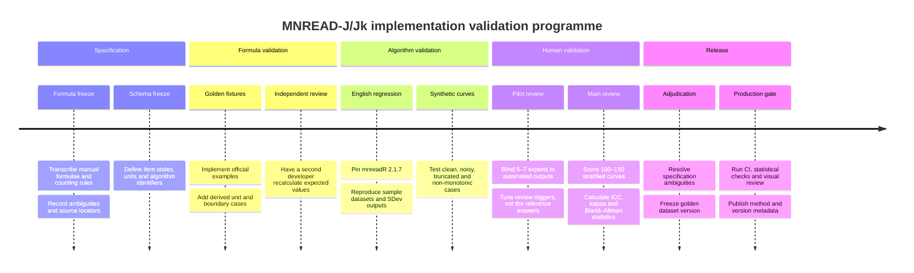
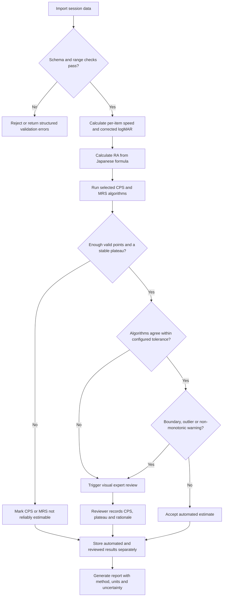

# MNREAD-J and MNREAD-Jk Analysis: Authoritative Formulae, Validation Data, and Implementation Verification

## Executive summary

The most defensible implementation strategy is to treat the **official 2002 MNREAD-J/Jk manual by Koichi Oda as the normative specification for Japanese scoring**, and to treat University of Minnesota materials, `mnreadR`, and later curve-fitting papers as secondary specifications for optional or comparative algorithms. MNREAD-J and MNREAD-Jk are not merely translations of English MNREAD: they use different test-unit lengths, different error units, a different standard viewing distance, and Japanese-specific reading-acuity equations. The Japanese manual specifies 30 characters per MNREAD-J item and 24 characters per MNREAD-Jk item, compared with ten standard words per English MNREAD sentence. citeturn2view0turn20search18

The core Japanese formulae are sufficiently explicit for reliable unit testing:

\[
RS_J=\frac{30-e}{t}\times60
\]

\[
RS_{Jk}=\frac{24-e}{t}\times60
\]

\[
RA_J=1.4-0.1N+\frac{E}{300}
\]

\[
RA_{Jk}=1.4-0.1N+\frac{E}{240}
\]

\[
L_{\mathrm{corrected}}
=
L_{\mathrm{chart}}
+
\log_{10}\left(\frac{30}{d_{\mathrm{cm}}}\right)
\]

where \(t\) is reading time in seconds, \(e\) is the number of incorrectly read or omitted characters in one item, \(N\) is the number of items read or attempted under the manual’s counting rules, and \(E\) is the cumulative number of character errors. citeturn2view0turn3view3

The main unresolved specification issue is **maximum reading speed calculation**. The manual defines MRS as the mean reading speed for items at or above CPS, but its worked example first averages three reading times and then converts the mean time into characters per minute. Those procedures are mathematically different. For the example times 4.45, 4.12, and 4.56 seconds, averaging the times gives 411.272 cpm, whereas averaging the three independently calculated speeds gives 412.041 cpm. The difference is small in the example, but it can become larger with noisier data. A conformant implementation should therefore name and test both methods rather than silently choosing one. citeturn3view0turn23view1

No public resource located in this review provides a complete, machine-readable set of **MNREAD-J/Jk raw inputs paired with authoritative expected RA, CPS, and MRS outputs**. The official manual supplies a few valuable worked examples; `mnreadR` supplies English-language raw example data and a reproducible implementation of the standard-deviation plateau algorithm; the public 101-curve dataset supplies expert CPS/MRS judgements and automated estimates; and the 645-participant dataset supplies population-level English MNREAD reference values. These resources should be combined with purpose-built Japanese test vectors. citeturn27search0turn6view0turn21search0

The recommended verification programme has four layers:

| Layer | Primary purpose | Recommended evidence |
|---|---|---|
| Formula conformance | Prove exact implementation of Japanese equations | Official-manual examples and derived boundary vectors |
| Algorithm regression | Prove that optional automated CPS methods behave as specified | Pinned `mnreadR` version and published SDev/NLME examples |
| Curve robustness | Test noisy, truncated, gradual and non-monotonic curves | Synthetic curves plus the public 101-curve collection |
| Clinical and educational credibility | Establish agreement with experienced users | Blinded expert review using ICC, Bland–Altman analysis and weighted Cohen’s kappa |

The implementation should preserve at least three separate CPS modes:

* **Manual-compatible visual CPS**, reproducing the Japanese manual’s graph-based judgement.
* **SDev CPS**, reproducing a documented `mnreadR`/Legge-style plateau algorithm.
* **Model-based CPS**, using an explicitly versioned equation and threshold, such as exponential-decay NLME at 80% or 90% of MRS, or a specified Weibull model.

These outputs must not be labelled interchangeable. Published work shows that CPS agreement is materially poorer than MRS agreement and that the selected algorithm and percentage threshold affect the result. In the 101-curve study, inter-rater ICC was approximately 0.97 for MRS but 0.77 for CPS, and differences of about 0.2 logMAR among raters were common enough to be clinically relevant. citeturn8view2turn8view3

## Source hierarchy and formula provenance

### Prioritised sources

The following ordering reflects suitability for specifying and validating a new MNREAD-J/Jk implementation, not merely publication prestige.

| Priority | Source and direct link | Authority and contribution | Use in an implementation |
|---|---|---|---|
| **Normative Japanese source** | [MNREAD-J/Jk Manual, provisional edition, 18 May 2002](https://www.cis.twcu.ac.jp/~k-oda/MNREAD-J/MNREAD-J-JkMan020518.pdf) | Official Japanese manual authored by Koichi Oda. Specifies chart composition, character-count speed formulae, RA equations, standard 30 cm distance, distance correction, visual CPS, MRS definition, worked examples and J/Jk interpretation cautions. citeturn2view0turn3view0turn3view3 | Primary specification for `MNREAD-J` and `MNREAD-Jk` modes. All formula-level tests should trace to a page or section of this manual. |
| **Official Japanese project page** | [MNREAD-J official home page](https://www.cis.twcu.ac.jp/~k-oda/MNREAD-J/) | Identifies MNREAD-J as a joint development of the University of Minnesota low-vision laboratory and Oda laboratory and distributes the manual and historical MNJA analyser. citeturn1view0turn19search0 | Provenance, version documentation and historical compatibility. It does not replace the manual as the computational specification. |
| **Official international MNREAD source** | [University of Minnesota: Reading Measures](https://mnread.umn.edu/reading-measures) | Official definitions for English MNREAD RA, error-corrected speed, CPS and MRS; English tests use ten standard words and a standard 40 cm distance. citeturn19search17turn20search18 | Reference for concepts and English-compatible regression testing. Do not copy English denominators, error units or 40 cm correction into Japanese modes. |
| **Official international overview** | [University of Minnesota MNREAD site](https://mnread.umn.edu/) | Defines RA, MRS, CPS and ACC and documents MNREAD’s institutional origin and intended applications. citeturn19search22 | Terminology, documentation and interoperability context. |
| **Open implementation reference** | [`mnreadR` CRAN mirror on GitHub](https://github.com/cran/mnreadR) and [CRAN archive](https://cran.r-project.org/src/contrib/Archive/mnreadR/) | Provides sample data, speed and distance functions, SDev-based MRS/CPS estimation, NLME functions, plotting and ACC calculation. Version 2.1.7 is the last archived release. The package was removed from active CRAN on 1 October 2025 after unresolved check issues, so validation must pin the archived version rather than assume the current CRAN command works. citeturn26view2turn27search0turn27search1turn27search8 | Executable oracle for English-mode regression tests and a transparent reference for missing-data conventions. It is not an official Japanese scorer. |
| **Primary CPS reliability study** | [Baskaran et al., 2019, PLOS ONE](https://journals.plos.org/plosone/article?id=10.1371/journal.pone.0216775) | Compares seven human raters, SDev estimates and NLME estimates across 101 low-vision MNREAD curves. Reports inter-rater ICCs, algorithm agreement and Bland–Altman results. citeturn6view1turn8view0turn8view2 | Main source for designing expert validation and understanding the attainable agreement for CPS. |
| **Public curve and judgement dataset** | [Swedish National Data Service dataset, DOI 10.5878/kfp8-3z35](https://researchdata.se/en/catalogue/dataset/2024-266) | Publicly exposes the numerical material associated with the 101-curve reliability study as `DATASET01.pdf`; the PLOS supplementary files include the curves and rater instructions. citeturn6view0turn8view0turn8view1 | Benchmark for visual CPS/MRS scoring and algorithm-versus-rater comparisons. Conversion from PDF to a structured local fixture should be manually checked. |
| **NLME method** | [Cheung et al., 2008, “Nonlinear Mixed-Effects Modeling of MNREAD Data”](https://iovs.arvojournals.org/article.aspx?articleid=2164115) | Compares two-limb and exponential-decay models and derives model-based MRS and CPS; reported analyses include CPS defined at 80% of MRS. citeturn21search8turn25view0 | Optional model-based algorithm. The equation, parameterisation, threshold and optimiser must be versioned together. |
| **Weibull model study** | [Nygaard, Echt and Schuchard, 2008, PubMed record](https://pubmed.ncbi.nlm.nih.gov/19009476/) and [available full text](https://scispace.com/pdf/models-of-reading-performance-in-older-adults-with-normal-44zh1td2kh.pdf) | Compares monotonic Weibull, logistic and Gompertz fits in 132 older readers. The monotonic Weibull had better convergence and lower residual error; a non-monotonic extension improved fitting in a subgroup with large-print fall-off. citeturn20search0turn24view2turn25view4 | Source for an optional Weibull mode and for synthetic non-monotonic test cases. It is not evidence that one Weibull parameterisation is the official Japanese algorithm. |
| **Recent Japanese model-based study** | [Comparison of CPS and MRS measurement methods for sentence and word tests, 2024](https://www.jstage.jst.go.jp/article/sor/65/3-4/65_171/_pdf/-char/en) | Applies Weibull fitting to Japanese 30-character sentence and 24-character/kana-word tests and uses an 80% MRS CPS cut-off. It also uses Bland–Altman analysis for method comparisons. citeturn24view0turn25view1turn25view2 | Japanese-language evidence supporting a separately labelled Weibull/80% analysis mode and method-comparison validation. |
| **ACC definition** | [Calabrèse et al., 2016, Reading Accessibility Index](https://legge.dl8.umn.edu/sites/legge.psych.umn.edu/files/2020-08/Calabrese16%20Development%20of%20a%20Reading%20Accessibility%20Index%20Using%20the%20MNREAD%20Acuity%20Chart.pdf) | Defines English ACC as mean reading speed over the ten largest print sizes from 1.3 to 0.4 logMAR at 40 cm, divided by 200 wpm, with explicit rules for missing or skipped sentences. citeturn18view2turn23view0 | Useful for an English-compatible mode. A Japanese cpm-based ACC requires independent validation and must not be presented as the published English ACC without evidence. |
| **Normal-vision reference dataset** | [MNREAD baseline dataset, DOI 10.13020/D6Q08Z](https://doi.org/10.13020/D6Q08Z) and [peer-reviewed article](https://iovs.arvojournals.org/article.aspx?articleid=2537421) | Covers 645 normally sighted participants aged 8–81 and reports MRS, CPS, RA and ACC across age. citeturn21search0turn19search10turn21search5 | Plausibility and population-level checks, not exact Japanese formula regression. |
| **Japanese contextual review** | [Ujima, “MNREAD and related research”](https://www.jstage.jst.go.jp/article/tokkyou/48/4/48_KJ00007226306/_pdf/-char/ja) | Reviews Japanese development, the 30-character J and 24-character Jk structures, educational and rehabilitation uses, and interpretation limitations of CPS. citeturn24view4 | Contextual validation, documentation and expert-review design. |
| **Japanese paediatric evidence** | [Ishii et al., 2006, MNREAD-JK reading-speed study](https://www.jstage.jst.go.jp/article/jorthoptic1977/35/0/35_0_147/_article/-char/ja/) | Reports Jk results in younger and older primary-school groups and young adults; MRS varied with age, while CPS and RA did not show the same age-group pattern. It also highlights language, learning and articulation influences on oral reading. citeturn19search6turn19search24 | Plausibility testing and interpretation of paediatric Jk results; it does not provide a public raw test-vector set. |

### Authority boundaries

The source hierarchy reveals three algorithm families that should remain explicit in software:

| Family | CPS rule | MRS rule | Status |
|---|---|---|---|
| Japanese-manual visual analysis | Identify the smallest size still within the visually judged plateau, immediately before reading speed begins to decline | Mean performance at and above the chosen CPS | Normative historical MNREAD-J/Jk procedure. The manual warns that automated output can underestimate CPS on irregular curves and instructs users to inspect the graph. citeturn2view0turn3view3 |
| SDev or plateau search | Identify a contiguous plateau whose speeds are sufficiently separated from off-plateau speeds, commonly using a 1.96-SD rule | Arithmetic mean of speeds in the accepted plateau | Documented by `mnreadR` and evaluated in the 101-curve study. citeturn26view2turn8view1 |
| Parametric fitted curve | Fit a named nonlinear model and find the print size corresponding to a declared proportion of fitted MRS, such as 80%, 90% or 95% | Fitted asymptote or average over a model-defined plateau | Research method. Results depend on equation, threshold, input transform, starting values, optimiser and bounds. citeturn25view0turn20search13turn24view2 |

A result such as “CPS = 0.6 logMAR” is therefore incomplete unless accompanied by an algorithm identifier, for example:

```text
CPS = 0.60 logMAR
method = manual_visual_2002
viewing-distance correction = Japanese 30 cm standard
```

or:

```text
CPS80 = 0.57 logMAR
method = weibull_monotonic_v1
cut-off = 80% fitted MRS
```

## Implementable formula specification

### Chart structure and units

At the standard 30 cm viewing distance, both Japanese charts contain 19 print-size levels from 1.3 to −0.5 logMAR in 0.1-logMAR steps. MNREAD-J uses 30-character passages arranged as three lines of ten characters. MNREAD-Jk uses 24 characters drawn from nine space-separated hiragana words. citeturn2view0

The manual defines Japanese chart logMAR from the visual angle of the reference character height:

\[
\operatorname{logMAR}
=
\log_{10}
\left(
\frac{\text{reference character-height visual angle}}{5\ \text{arcmin}}
\right)
\]

The chart was calibrated using the height of the Japanese character “国”, rather than the English lowercase x-height convention being assumed implicitly. citeturn2view0

### Per-item reading speed

For a positive reading time \(t\):

\[
RS_J(t,e)
=
60\frac{30-e}{t}
\quad \text{characters/minute}
\]

\[
RS_{Jk}(t,e)
=
60\frac{24-e}{t}
\quad \text{characters/minute}
\]

The allowed character-error ranges should be enforced:

\[
0\le e\le30 \quad\text{for J}
\]

\[
0\le e\le24 \quad\text{for Jk}
\]

When all characters are missed, the manual assigns a reading speed of zero. citeturn2view0

The application should reject rather than silently repair:

* zero or negative time;
* negative errors;
* errors exceeding the item capacity;
* fractional character-error counts, unless an explicitly documented scoring extension permits them;
* a “read” item with both time and status missing.

### Viewing-distance correction

For Japanese charts, whose standard distance is 30 cm:

\[
\Delta L
=
\log_{10}\left(\frac{30}{d}\right)
\]

\[
L_{\mathrm{corrected}}
=
L_{\mathrm{chart}}+\Delta L
\]

where \(d\) is the actual distance in centimetres. At 15 cm:

\[
\Delta L=\log_{10}(2)=0.3010299957
\]

At 60 cm:

\[
\Delta L=\log_{10}(0.5)=-0.3010299957
\]

The manual also gives the corresponding M-unit magnification correction as \(30/d\). citeturn3view3

The standard distance must be a test-variant attribute, not a global constant. English MNREAD uses 40 cm, while J/Jk use 30 cm. citeturn20search18turn2view0

### Reading acuity

The official Japanese equations are:

\[
RA_J=1.4-0.1N+\frac{E}{300}
\]

\[
RA_{Jk}=1.4-0.1N+\frac{E}{240}
\]

Here:

* \(N\) is the number of chart items read or attempted according to the manual’s stopping and skipped-item rules.
* \(E\) is the cumulative number of misread or omitted characters across those items.
* Larger items intentionally omitted at the start are counted as if correctly read when the manual’s conditions are satisfied. citeturn2view0

After calculating the chart-based RA, apply the viewing-distance correction:

\[
RA_{\mathrm{corrected}}
=
RA_{\mathrm{chart}}
+
\log_{10}\left(\frac{30}{d}\right)
\]

The manual’s worked example has \(N=8\), \(E=59\), and \(d=15\) cm:

\[
RA_{\mathrm{chart}}
=
1.4-0.8+\frac{59}{300}
=
0.7966666667
\]

\[
RA_{\mathrm{corrected}}
=
0.7966666667+0.3010299957
=
1.0976966624
\]

which the manual reports, after display rounding, as approximately 1.1 logMAR. citeturn3view1turn3view2

Decimal acuity is:

\[
VA_{\mathrm{decimal}}=10^{-RA}
\]

which is equivalent to the manual’s \(1/10^{RA}\). citeturn2view0

### Critical print size

The manual’s CPS procedure is primarily visual:

1. Plot reading speed against print size.
2. Identify the nearly constant large-print plateau.
3. Moving towards smaller print, identify where speed starts to fall.
4. Select the preceding size—the smallest size that still supports maximum speed.
5. Apply the viewing-distance correction.

In the worked example, the chart CPS is judged to be 1.1 logMAR. At 15 cm, this becomes:

\[
1.1+\log_{10}(30/15)=1.4010299957
\]

reported as 1.4 logMAR. citeturn3view0turn23view1

The manual explicitly advises visual inspection when an automated programme gives an implausibly small CPS for irregular data. That warning should become a software requirement: automated CPS is a proposed estimate, not an unquestionable result. citeturn3view3

### Maximum reading speed and the manual ambiguity

The textual definition implies:

\[
MRS_{\mathrm{mean\ speed}}
=
\frac{1}{K}\sum_{i=1}^{K}RS_i
\]

for the \(K\) items on the plateau at or above CPS. citeturn2view0turn26view2

The worked example instead calculates:

\[
\bar t=\frac{4.45+4.12+4.56}{3}=4.376666\ldots
\]

\[
MRS_{\mathrm{mean\ time}}
=
\frac{30}{\bar t}\times60
=
411.271896\ \mathrm{cpm}
\]

and reports 411 cpm. citeturn3view0turn23view1

Calculating each speed and then averaging gives:

\[
\frac{1}{3}
\left(
\frac{1800}{4.45}
+
\frac{1800}{4.12}
+
\frac{1800}{4.56}
\right)
=
412.041476\ \mathrm{cpm}
\]

The recommended data model is therefore:

```text
mrs_method:
  manual_2002_mean_time
  arithmetic_mean_speed
  sdev_plateau_mean_speed
  fitted_asymptote
```

For historical reproduction, `manual_2002_mean_time` should reproduce the worked example. For a literal implementation of the stated definition and interoperability with `mnreadR`, `arithmetic_mean_speed` should also be available. Expert review should decide which is displayed as the default Japanese result.

### Algorithms that must remain optional

The following should not silently replace the manual method:

**SDev algorithm.** `mnreadR` defines a plateau as a print-size region with speeds at least 1.96 standard deviations faster than speeds outside the plateau; MRS is the mean plateau speed and CPS is its smallest print size. It returns no CPS/MRS where three or fewer sentences were read and recommends ACC in that English-language situation. citeturn26view2

**Virgili-style rule.** A Japanese review of the literature describes criteria requiring smaller-print speeds to be below both the plateau mean minus 1.96 standard deviations and 95% of the larger-print mean. citeturn25view0

**NLME exponential-decay model.** Cheung and colleagues evaluated nonlinear mixed-effects models and used a percentage of MRS—reported as 80% in the cited work—to identify CPS. citeturn21search8turn25view0

**Weibull model.** Nygaard and colleagues found a monotonic Weibull model to converge more successfully and with lower residual error than logistic or Gompertz alternatives in their older-adult dataset. A non-monotonic extension fitted large-print fall-off in approximately 22% of their regressible datasets. Recent Japanese research has used a Weibull fit with an 80% MRS cut-off. citeturn24view2turn25view4turn25view1

“CPS by Weibull” is not a complete algorithm name. The specification must additionally identify:

```text
model equation
dependent-variable scale: cpm or log(cpm)
independent-variable scale: logMAR or visual angle
monotonic or non-monotonic form
parameter bounds
initialisation method
loss or likelihood
optimiser and software version
CPS cut-off: e.g. 80%, 90%, 95%
handling of zero speeds
handling of skipped and unread items
```

## Validation data assets and known gaps

### Official-manual examples

The Japanese manual provides the strongest golden values because they are part of the source specification rather than observations from another language.

| Fixture | Inputs | Exact expected result | Published/display result |
|---|---|---:|---:|
| Distance correction | \(d=15\) cm | \(+0.3010299957\) logMAR | \(+0.3\) |
| Worked CPS | chart CPS \(=1.1\), \(d=15\) cm | \(1.4010299957\) logMAR | \(1.4\) |
| Worked RA | J, \(N=8\), \(E=59\) | \(0.7966666667\) logMAR | \(0.8\) before distance correction |
| Worked corrected RA | above, \(d=15\) cm | \(1.0976966624\) logMAR | \(1.1\) |
| Worked MRS, manual calculation | J, zero plateau errors, times 4.45, 4.12, 4.56 s | \(411.2718964\) cpm using mean-time method | \(411\) cpm |
| Same MRS inputs, literal mean-speed definition | same | \(412.0414760\) cpm | Not shown in manual; retain as ambiguity test |

The source rounds intermediate values for explanatory purposes. Golden tests should calculate at full floating-point precision and apply rounding only in a separate presentation layer. citeturn3view0turn3view1turn23view1

Additional formula-derived vectors should be marked **derived from the official formula**, not “official worked examples”. For example, J with five seconds and two errors is exactly 336 cpm, while Jk with six seconds and no errors is exactly 240 cpm.

### `mnreadR` sample datasets

The package contains two `.rda` datasets:

| Filename/object | Size | Variables | Intended use |
|---|---:|---|---|
| `data_low_vision.rda` / `data_low_vision` | 437 rows, seven variables | `subject`, `polarity`, `treatment`, `vd`, `ps`, `rt`, `err` | Twelve low-vision participants, treatment groups and regular/reverse polarity; useful for missing-data and atypical-curve regression. citeturn16view0 |
| `data_normal_vision.rda` / `data_normal_vision` | 684 rows, six variables | `subject`, `polarity`, `vd`, `ps`, `rt`, `err` | Eighteen young adults with regular/reverse polarity; useful for typical plateau curves and skipped large-print cases. citeturn16view1 |

Variable meanings are:

| Variable | Meaning |
|---|---|
| `subject` | Participant identifier |
| `polarity` | Regular or reversed contrast |
| `treatment` | Treatment grouping in the low-vision sample |
| `vd` | Viewing distance in centimetres |
| `ps` | Uncorrected chart print size in logMAR |
| `rt` | Reading time in seconds |
| `err` | Word-error count for the English ten-word sentence |

The repository’s example for low-vision participant `s1` includes decreasing print sizes from 1.3 logMAR, a 20 cm viewing distance, measured reading times, an error at 0.6 logMAR, an unread 0.5-logMAR sentence represented by `rt=NA, err=10`, and smaller unpresented sentences represented by `NA, NA`. citeturn27search0turn26view2

As of July 2026, a reproducible installation should use the archive rather than the obsolete `install.packages("mnreadR")` instruction:

```r
install.packages(
  "https://cran.r-project.org/src/contrib/Archive/mnreadR/mnreadR_2.1.7.tar.gz",
  repos = NULL,
  type = "source"
)

library(mnreadR)

data("data_low_vision")
data("data_normal_vision")

str(data_low_vision)
str(data_normal_vision)

head(data_low_vision, 10)
```

Version 2.1.7 was archived on 18 January 2024, and the package was removed from active CRAN on 1 October 2025. citeturn27search1turn27search8

A basic regression run is:

```r
library(dplyr)
library(mnreadR)

s1_regular <- data_low_vision |>
  filter(subject == "s1", polarity == "regular")

result <- mnreadParam(
  s1_regular,
  ps,
  vd,
  rt,
  err
)

print(result)
mnreadCurve(
  s1_regular,
  ps,
  vd,
  rt,
  err
)
```

The package explicitly recommends inspecting the plotted curve rather than relying solely on its CPS/MRS output. citeturn26view2turn27search0

These datasets are valuable but require an adapter:

* Their errors are **English word errors**, not Japanese character errors.
* Their standard distance is **40 cm**, not 30 cm.
* Their speeds are **words per minute**, not characters per minute.
* Their English RA and ACC equations are not Japanese RA equations.

The cleanest comparison is to implement a distinct `MNREAD-English-10-word` compatibility mode, verify that against `mnreadR`, and then share only generic components—data validation, curve plotting and selected CPS algorithms—with J/Jk modes.

### Public 101-curve dataset

The Swedish National Data Service record associated with Baskaran et al. provides open access to `DATASET01.pdf`, described as numerical data, with the DOI [10.5878/kfp8-3z35](https://doi.org/10.5878/kfp8-3z35). The associated study contains 101 low-vision MNREAD curves assessed by seven raters with differing experience and compared with SDev and NLME methods. citeturn6view0turn8view0turn8view1

Confirmed content relevant to validation includes:

* an identifier for each of the 101 curves;
* visual MRS and CPS estimates from seven raters;
* SDev-derived MRS and CPS;
* NLME-derived estimates for percentage-of-MRS definitions discussed in the paper, including 80% and 90% comparisons;
* curve plots in the PLOS supplementary material;
* the written instructions supplied to the raters. citeturn8view0turn8view1turn8view3

The repository distributes a PDF rather than a tidy CSV. It is therefore best used as a **curated secondary benchmark**:

1. transcribe or extract the numerical table once;
2. perform row-by-row visual verification against the PDF;
3. retain the original PDF SHA-256 digest and page references;
4. store the converted data as an immutable local fixture;
5. do not treat OCR output as authoritative without manual checking.

It is particularly suitable for testing:

* whether the application’s manual-review screen supports expert judgement;
* whether SDev and fitted-CPS implementations reproduce published outputs;
* how often the automated estimate differs from the median human estimate by 0, 0.1, 0.2 or more logMAR;
* whether the application correctly flags difficult curves.

### Public 645-participant dataset

The University of Minnesota dataset [DOI 10.13020/D6Q08Z](https://doi.org/10.13020/D6Q08Z) contains MNREAD estimates from normally sighted participants aged 8–81 and accompanies the peer-reviewed baseline study. Confirmed measures are age, MRS, CPS, RA and ACC; the study pooled observations across studies, sites and testers. citeturn21search0turn21search5

A metadata inconsistency requires explicit provenance handling:

* the abstract and peer-reviewed paper report **645 participants**;
* one repository-description field says **654 participants**.

The repeated 645 figure in the abstract, title-associated records and methods should be used as the expected cohort size, while the conflicting repository text should be documented as a probable metadata error rather than silently corrected. citeturn21search0turn21search5

The indexed repository metadata available during this review did not expose a reliable file-level inventory or delimiter specification. Before automating ingestion, download the deposited object and record:

```text
original filename
media type
delimiter or workbook sheet names
encoding
row count
column names
missing-value representation
repository checksum
download date
```

The dataset is primarily a **summary-measure and plausibility dataset**, not necessarily a raw sentence-by-sentence timing dataset. Its appropriate uses are:

* verifying expected value ranges;
* reproducing age-related descriptive analyses;
* checking that aggregate calculations and plots are sensible;
* detecting unit mistakes such as cpm being interpreted as wpm or 30 cm as 40 cm.

It should not be used as a direct numerical oracle for Japanese J/Jk results.

### Gaps in Japanese-specific validation data

No located public source provides all of the following together:

```text
MNREAD-J or MNREAD-Jk variant
item-level chart logMAR
actual viewing distance
reading time for every attempted item
character-error count for every item
item status: read, unread, unpresented or skipped
authoritative RA
authoritative CPS
authoritative MRS
declared CPS and MRS algorithm
full-precision expected values
```

The largest gaps are:

* no public machine-readable J/Jk golden dataset;
* no public authoritative answer set for the historical MNJA Flash analyser;
* no published resolution of the manual’s mean-time versus mean-speed MRS ambiguity;
* no large public J/Jk collection with multiple expert CPS judgements;
* no validated Japanese equivalent of the English 200-wpm ACC normalising constant;
* limited public documentation of the exact algorithm used by contemporary digital Japanese MNREAD implementations.

Consequently, the implementation project should publish its **numeric validation fixtures and algorithm metadata**, while avoiding redistribution of protected chart sentences unless the relevant licence permits it.

## Proposed validation corpus and schemas

### Corpus layers

The recommended suite has four independently versioned layers.

| Layer | Content | Approximate scale | Purpose |
|---|---|---:|---|
| `official-golden` | Manual examples and exact formula-derived J/Jk vectors | 20–40 sessions | Exact equation, distance and rounding conformance |
| `boundary-and-property` | Invalid, missing, extreme and stopping-rule cases | 40–80 sessions | Input validation and deterministic state handling |
| `synthetic-curves` | Typical, noisy, gradual, non-monotonic and truncated curves | 100–500 generated sessions | CPS algorithm stress testing and review-trigger calibration |
| `external-real-world` | Pinned `mnreadR` samples, converted 101-curve data, 645-participant summaries, locally collected J/Jk cases | Version-dependent | Regression, statistical agreement and ecological credibility |

Each fixture should distinguish its epistemic status:

```text
authority:
  official_worked_example
  formula_derived
  published_external
  synthetic
  locally_expert_adjudicated
```

### Long-format CSV schema

A sentence- or item-level file should use one row per presented or potentially presentable chart item:

```csv
schema_version,case_id,session_id,source_id,authority,variant,chart_version,item_index,chart_logmar,standard_distance_cm,viewing_distance_cm,time_s,error_count,error_unit,item_status,polarity,sequence_direction,expected_speed_cpm,include_in_ra,include_in_curve,notes
```

Recommended values include:

```text
variant:
  MNREAD-J
  MNREAD-Jk
  MNREAD-English-10-word

error_unit:
  character
  word

item_status:
  read
  attempted_unread
  presented_time_missing
  unpresented_after_stop
  skipped_large_assumed_readable
  skipped_large_unreadable
```

Session-level expected results should be kept in a second CSV rather than repeated on every item:

```csv
case_id,algorithm_id,mrs_method,cps_cutoff,expected_ra_chart_logmar,expected_distance_correction_logmar,expected_ra_corrected_logmar,expected_mrs,expected_cps_chart_logmar,expected_cps_corrected_logmar,expected_review_flag,tolerance_speed,tolerance_logmar,source_locator
```

### Nested JSON schema

JSON is preferable for preserving multiple expected algorithms for one curve:

```json
{
  "schema_version": "1.0.0",
  "case_id": "J-MANUAL-RA-001",
  "authority": "official_worked_example",
  "source": {
    "title": "MNREAD-J/Jk Manual",
    "version": "2002-05-18",
    "locator": "Section 4.5",
    "url": "https://www.cis.twcu.ac.jp/~k-oda/MNREAD-J/MNREAD-J-JkMan020518.pdf"
  },
  "test": {
    "variant": "MNREAD-J",
    "standard_distance_cm": 30,
    "viewing_distance_cm": 15,
    "error_unit": "character"
  },
  "summary_input": {
    "attempted_item_count": 8,
    "cumulative_errors": 59
  },
  "expected": {
    "distance_correction_logmar": 0.3010299956639812,
    "ra_chart_logmar": 0.7966666666666666,
    "ra_corrected_logmar": 1.0976966623306478,
    "display_ra_logmar_1dp": 1.1
  },
  "tolerances": {
    "calculation_absolute": 1e-10,
    "display_absolute": 0.05
  }
}
```

For curve data, add an `items` array and multiple expected analyses:

```json
{
  "items": [
    {
      "item_index": 1,
      "chart_logmar": 1.3,
      "time_s": 4.45,
      "errors": 0,
      "status": "read"
    }
  ],
  "analyses": [
    {
      "algorithm_id": "manual_visual_2002",
      "expected_cps_logmar": 1.4
    },
    {
      "algorithm_id": "sdev_mnreadr_2.1.7",
      "expected_cps_logmar": null
    }
  ]
}
```

### Example validation records

| Case ID | Type | Input | Expected result | Provenance |
|---|---|---|---|---|
| `J-RS-DERIVED-001` | Per-item speed | J; \(t=5.0\) s; \(e=2\) | \(336.000000\) cpm | Derived exactly from official J speed formula |
| `JK-RS-DERIVED-001` | Per-item speed | Jk; \(t=6.0\) s; \(e=0\) | \(240.000000\) cpm | Derived exactly from official Jk speed formula |
| `J-CPS-MANUAL-001` | Distance-corrected CPS | chart CPS 1.1; distance 15 cm | 1.4010299957 logMAR; display 1.4 | Official worked example citeturn3view0 |
| `J-RA-MANUAL-001` | Reading acuity | \(N=8\); \(E=59\); distance 15 cm | raw 0.7966666667; corrected 1.0976966624; display 1.1 | Official worked example citeturn3view1turn3view2 |
| `J-MRS-MANUAL-001` | MRS ambiguity | times 4.45, 4.12, 4.56; zero errors | mean-time 411.2718964 cpm; mean-speed 412.0414760 cpm | Official input and reported mean-time method; alternative follows textual definition citeturn3view0turn23view1 |

### Boundary and state cases

| ID | Test case | Required behaviour |
|---|---|---|
| `B01` | Zero errors with valid positive time | Calculate full-capacity speed |
| `B02` | Errors equal item capacity: 30 for J or 24 for Jk | Return exactly zero speed |
| `B03` | Errors greater than capacity | Reject as invalid; do not clamp silently |
| `B04` | Zero or negative reading time | Reject as invalid |
| `B05` | Negative or fractional character errors | Reject unless an explicit scoring extension is enabled |
| `B06` | Presented and read, but time missing | Preserve as `presented_time_missing`; do not invent speed |
| `B07` | Smallest item presented but entirely unread | Zero speed and attempted status; include according to RA stopping rule |
| `B08` | Smaller items not presented after stopping | Preserve as unpresented; exclude from RA and curve unless the selected method explicitly assigns zero |
| `B09` | Large item skipped because it was clearly readable | Preserve reason; apply only the selected manual/ACC imputation rule |
| `B10` | Large item skipped because large print was unreadable, such as a ring-scotoma pattern | Represent separately from ordinary small-print failure |
| `B11` | Standard distance exactly 30 cm | Correction must be exactly zero, subject only to floating-point representation |
| `B12` | Nearer and farther distances, including 15 and 60 cm | Corrections must be equal and opposite: approximately ±0.30103 |
| `B13` | Three or fewer valid speed observations | SDev mode returns “not estimable”; manual review remains available |
| `B14` | Gradual decline with no stable plateau | Do not force a high-confidence CPS; raise manual-review flag |
| `B15` | One extreme speed outlier in an otherwise stable plateau | Flag outlier and report sensitivity with and without it; retain raw data |
| `B16` | Non-monotonic curve with large-print fall-off | Avoid assuming the largest items form the plateau; trigger non-monotonic review/model option |
| `B17` | CPS at smallest or largest tested boundary | Mark as censored or range-limited rather than treating it as an interior estimate |
| `B18` | Same times/errors passed to J and Jk | Confirm distinct capacities and RA denominators |
| `B19` | Starting at a smaller item and omitting readable large items | Apply the manual’s \(N\)-count rule and document the inferred items |
| `B20` | Duplicate print-size rows or out-of-order sizes | Either normalise deterministically with an audit warning or reject; never silently overwrite |

`mnreadR` already distinguishes several missing-data states—unread smallest sentence, unpresented smaller sentences, missing timing, skipped readable large print and skipped unreadable large print—which provides a useful state-model reference even though its error count is word-based. citeturn26view2

### Synthetic curve families

The generator should operate on an underlying speed function, add timing and error noise, and then reconstruct observed speeds through the same public formula used by the application. This tests the whole pipeline rather than only the curve fitter.

| Family | Construction | Expected review behaviour |
|---|---|---|
| Clean two-limb | Flat plateau followed by sharp decline | All reasonable methods should agree within one 0.1-logMAR chart step |
| Noisy plateau | Gaussian or log-normal timing variation on plateau | Automated estimate accepted only if stability criteria remain satisfied |
| Gradual transition | Broad shallow decline | Expect disagreement between visual, SDev and percentage-cut-off methods |
| Single low outlier | One unusually long reading time on plateau | Sensitivity warning; robust fit should not shift CPS excessively |
| Single high outlier | One implausibly short time | Data-quality warning and influence diagnostic |
| Large-print fall-off | Speed decreases at the largest print sizes | Non-monotonic or ring-scotoma review trigger |
| Two apparent plateaux | Mid-size plateau and a second high-size region | Require explicit algorithm behaviour and visual review |
| Truncated small-print limb | Testing stopped before a clear decline | CPS right/left censoring flag, depending on axis convention |
| Truncated large-print limb | No adequate plateau observations | MRS and CPS not estimable with confidence |
| High error near threshold | Timing remains fast but error count rises | Corrected speed and RA must reflect errors rather than timing alone |
| Heteroscedastic noise | Variance increases near acuity limit | Test weighted versus unweighted fitting |
| Sparse curve | Every other 0.1-logMAR level missing | Examine interpolation sensitivity |
| J/Jk paired curve | Same latent performance but 30- versus 24-character items | Check correct speed conversion and expected sampling variance |
| Quantised timing | Times rounded to 0.1 or 1.0 seconds | Assess rounding bias, especially at very fast speeds |
| Implausibly fast/slow | Near equipment or human limits | Raise range warning without deleting the record |

Random synthetic fixtures should store the random seed, generator version and latent parameters. A small deterministic subset should run on every commit; a larger seeded simulation can run nightly.

## Validation methods and acceptance criteria

### Formula unit tests

Formula tests should have two levels:

**Full-precision calculation tests.** Compare the unrounded internal value with the exact expected double-precision or decimal result.

**Presentation tests.** Compare formatted values after applying an explicitly declared rounding policy.

Recommended computational tolerances are:

| Quantity | Proposed unit-test tolerance |
|---|---:|
| Per-item speed | absolute error \(\le 10^{-10}\) cpm |
| Distance correction | absolute error \(\le 10^{-12}\) logMAR |
| RA before display rounding | absolute error \(\le 10^{-10}\) logMAR |
| Manual mean-time MRS | absolute error \(\le 10^{-9}\) cpm |
| Decimal acuity | relative error \(\le 10^{-10}\) |
| Display at one decimal logMAR | exact formatted-string agreement |
| Display at whole cpm | exact agreement under the declared rounding rule |

These are software-engineering tolerances, not clinical repeatability limits. The calculations are simple enough that larger numerical tolerances would conceal implementation errors.

Property-based tests should also verify:

\[
RS(t,e+1)\le RS(t,e)
\]

\[
RS(t_2,e)\le RS(t_1,e)\quad\text{when }t_2\ge t_1
\]

\[
RA_J(N,E+1)>RA_J(N,E)
\]

and:

\[
\Delta L(d)+\Delta L(900/d)=0
\]

for paired distances whose product is \(30^2=900\), apart from floating-point tolerance.

### Regression testing against `mnreadR`

Regression should be performed in an English-compatible mode, not by forcing Japanese data into English equations.

A pinned environment should include:

```text
R version
mnreadR 2.1.7 source archive checksum
dependency versions
operating-system/container image
locale
random-number generator settings
```

For every `subject × polarity × treatment`, where applicable:

1. load the original package data;
2. calculate corrected print sizes;
3. calculate error-corrected reading speeds;
4. calculate RA;
5. estimate SDev MRS and CPS;
6. generate a curve;
7. compare the values with saved `mnreadR` outputs;
8. retain warnings and missing-result states.

Proposed regression criteria are:

| Component | Acceptance criterion |
|---|---|
| Input-state mapping | Exact categorical agreement |
| Corrected print size | \(\le10^{-10}\) logMAR difference |
| Error-corrected speed | \(\le10^{-8}\) wpm difference |
| English RA | \(\le10^{-8}\) logMAR difference |
| SDev CPS on chart grid | Exact 0.1-logMAR-step agreement |
| SDev MRS | absolute difference \(\le0.01\) wpm |
| Not-estimable state | Exact agreement |
| Warning/review state | Exact agreement for specified cases |

If the new implementation intentionally fixes an apparent `mnreadR` issue, the mismatch should become a documented “known divergence” fixture rather than being hidden by relaxed tolerances.

### Statistical comparison of algorithms

For each curve and algorithm, retain:

```text
CPS estimate
MRS estimate
RA estimate
fit convergence status
number of valid observations
residual error
algorithm warnings
manual-review status
```

Compare algorithms using:

* mean and median difference;
* mean absolute error and median absolute error;
* root-mean-square error;
* proportion of CPS estimates exactly matching;
* proportion within one chart step, ±0.1 logMAR;
* proportion within two chart steps, ±0.2 logMAR;
* MRS absolute and percentage difference;
* intraclass correlation;
* Bland–Altman bias and 95% limits of agreement;
* threshold-specific sensitivity analyses for CPS80, CPS90 and CPS95.

The 101-curve paper is an important reality check: MRS was much more reproducible than CPS, inter-rater CPS agreement was only moderate-to-good rather than nearly perfect, and algorithm-versus-rater CPS agreement depended on the model threshold. citeturn8view2turn8view3

### Blinded inter-rater CPS study

A practical expert study should use **five to seven experienced raters**, with seven preferred when feasible because it supports direct comparison with the published 101-curve design. The raters should include people experienced in Japanese low-vision assessment and, where Jk is evaluated, people familiar with paediatric or educational assessment. citeturn8view0turn19search6

A recommended protocol is:

| Element | Design |
|---|---|
| Curves | Pilot with approximately 30; main evaluation with 100–150, stratified across typical, noisy, truncated, high-error and non-monotonic shapes |
| Blinding | Hide all automated results, algorithm names, other raters’ decisions and expected values |
| Ordering | Randomise independently for each rater |
| Replicates | Repeat 15–20% of curves without announcing which are duplicates |
| Display | Identical axes, units, aspect ratio and point annotations for every rater |
| Decisions | CPS, plateau start/end, included plateau points, MRS and confidence category |
| Rationale | Short coded reason such as `clear_plateau`, `gradual_decline`, `outlier`, `truncated`, `nonmonotonic` |
| Consensus | Median CPS on the 0.1-logMAR grid; mean or trimmed mean MRS; adjudication meeting only after initial scoring is locked |
| Audit | Timestamp, software version, display configuration and any zoom or point-exclusion action |

Recommended agreement statistics are:

**ICC for continuous values.** Use a two-way random-effects, absolute-agreement model. Report ICC(2,1) for one rater and ICC(2,k) for the panel mean, each with bootstrap or analytical 95% confidence intervals. Baskaran et al. used ICC to quantify both inter-rater and algorithm agreement and reported substantially higher reliability for MRS than CPS. citeturn8view2

**Bland–Altman analysis.** Compare implementation minus expert consensus for CPS and percentage MRS difference. Report bias, 95% limits of agreement and plots for possible proportional bias. Published MNREAD work has used Bland–Altman analysis both for algorithm comparison and for Japanese method comparison. citeturn8view2turn25view2

**Weighted Cohen’s kappa.** Treat CPS values as ordered 0.1-logMAR categories and use quadratic weighting for each algorithm-versus-rater and algorithm-versus-consensus comparison. Cohen’s kappa is pairwise; for a single multi-rater summary, add Fleiss’ kappa or a multi-rater weighted alternative rather than mislabelling it Cohen’s kappa.

**Exact-step agreement.** Report exact agreement, agreement within one step and agreement within two steps. This is readily interpretable alongside ICC and protects against an apparently high correlation caused by a wide range of CPS values.

**Intra-rater repeatability.** Analyse duplicate curves separately using weighted kappa, ICC and exact-step agreement.

### Proposed acceptance criteria

The following are **recommended engineering release gates**, not established clinical standards. They should be reviewed after the pilot study.

| Domain | Initial acceptance target |
|---|---|
| Official formula fixtures | 100% pass at declared numerical tolerance |
| Invalid input handling | 100% expected rejection/state agreement |
| `mnreadR` English compatibility | 100% speed, correction and RA regression pass; at least 99% exact SDev CPS reproduction, with every divergence documented |
| Deterministic synthetic clean curves | CPS within 0.1 logMAR of latent CPS in at least 95% |
| Expert CPS agreement | Median bias no more than 0.05 logMAR |
| Expert CPS step agreement | At least 90% within ±0.2 logMAR |
| CPS ICC | ICC(2,1) at least 0.75 and ICC(2,k) at least 0.90, with confidence intervals reported |
| Weighted CPS kappa | At least 0.80 against adjudicated consensus |
| MRS bias | Absolute mean percentage bias no more than 3% |
| MRS agreement | ICC at least 0.90 |
| Severe failure | No unflagged NaN, infinity, negative speed, impossible error count or silent imputation |
| Review sensitivity | At least 95% of predefined atypical synthetic curves trigger the expected review condition |
| Review burden | Fewer than approximately 20% of clean typical curves should trigger unnecessary review after threshold tuning |

Because published human CPS agreement is imperfect, expert disagreement should not automatically be treated as an implementation defect. The application should expose uncertainty and disagreement rather than forcing a false single “ground truth”.

## Verification workflow, CI, tools and visual reporting

### Recommended implementation workflow

The verification programme should proceed in an order that prevents model complexity from obscuring basic formula errors.



A recommended review decision process is:



### Continuous-integration test matrix

| CI tier | Frequency | Tests |
|---|---|---|
| Fast commit suite | Every commit | Formula golden tests, schema validation, property tests, deterministic boundary cases |
| Pull-request suite | Every pull request | Full synthetic deterministic corpus, English `mnreadR` regression, JSON/CSV round-trip tests |
| Nightly suite | Nightly | Hundreds of seeded noisy curves, multiple solver initialisations, cross-platform numerical comparison |
| Release-candidate suite | Before release | Full external datasets, statistical acceptance gates, report snapshots, expert-adjudicated fixtures |
| Manual clinical review | Major algorithm change | Blinded review of changed outputs and all automatically flagged cases |

CI should pin:

```text
language/runtime version
dependency lockfile
floating-point architecture where relevant
solver version
optimiser settings
random seed
locale and decimal separator
chart specification version
fixture-dataset checksum
```

Visual plots should not be tested solely through brittle pixel comparison. Prefer assertions such as:

```text
number of plotted valid points
CPS line coordinate
MRS line coordinate
excluded-point count
axis limits and units
review-warning annotation
```

A small set of rendered reference images may still be manually inspected before release.

### Automatic visual-review triggers

The application should request human inspection when any of the following occurs:

* three or fewer valid speed observations;
* no plateau containing at least two or three adjacent print sizes;
* CPS lies at the first or last tested print size;
* visual/SDev/fitted CPS differ by more than 0.1–0.2 logMAR;
* mean-time and mean-speed MRS differ by more than a configured percentage;
* one observation has excessive influence on CPS;
* speed rises and then falls across large print;
* residuals show systematic curvature;
* fit fails to converge or converges at a parameter bound;
* the selected percentage cut-off lies outside the measured print-size range;
* zero speeds or missing states are handled differently by competing algorithms;
* RA is better than the smallest tested size or otherwise depends on extrapolation;
* observed values violate basic ranges or units;
* J and Jk result patterns differ enough to suggest a text-versus-kana interpretation issue.

### R tooling

A reproducible R project can use:

```r
library(dplyr)
library(tidyr)
library(ggplot2)
library(mnreadR)

data("data_low_vision")
data("data_normal_vision")

english_results <- mnreadParam(
  data_low_vision,
  ps,
  vd,
  rt,
  err,
  subject,
  polarity,
  treatment
)

print(english_results)
```

For reproducibility, save:

```r
sessionInfo()
packageVersion("mnreadR")
tools::md5sum(
  "mnreadR_2.1.7.tar.gz"
)
```

Use `renv` or a container lock to preserve dependency versions. The GitHub repository is a read-only CRAN mirror and should be treated as source inspection or emergency installation material, not as evidence of ongoing maintenance. citeturn27search0turn27search8

### Python reference implementation

The formula layer should remain small, typed and independent of the curve-fitting layer:

```python
from __future__ import annotations

from dataclasses import dataclass
from math import isfinite, log10
from typing import Literal

Variant = Literal["MNREAD-J", "MNREAD-Jk"]


@dataclass(frozen=True)
class VariantSpec:
    characters_per_item: int
    ra_error_denominator: int
    standard_distance_cm: float = 30.0


SPECS: dict[Variant, VariantSpec] = {
    "MNREAD-J": VariantSpec(
        characters_per_item=30,
        ra_error_denominator=300,
    ),
    "MNREAD-Jk": VariantSpec(
        characters_per_item=24,
        ra_error_denominator=240,
    ),
}


def reading_speed_cpm(
    variant: Variant,
    time_s: float,
    errors: int,
) -> float:
    """Calculate error-corrected MNREAD-J/Jk speed in characters/minute."""
    spec = SPECS[variant]

    if not isfinite(time_s) or time_s <= 0:
        raise ValueError("time_s must be finite and greater than zero")
    if isinstance(errors, bool) or not isinstance(errors, int):
        raise TypeError("errors must be an integer character count")
    if not 0 <= errors <= spec.characters_per_item:
        raise ValueError(
            f"errors must be between 0 and {spec.characters_per_item}"
        )

    return (
        60.0
        * (spec.characters_per_item - errors)
        / time_s
    )


def distance_correction_logmar(
    viewing_distance_cm: float,
    standard_distance_cm: float = 30.0,
) -> float:
    """Return the additive angular-size correction in logMAR."""
    if (
        not isfinite(viewing_distance_cm)
        or viewing_distance_cm <= 0
    ):
        raise ValueError(
            "viewing_distance_cm must be finite and greater than zero"
        )
    if (
        not isfinite(standard_distance_cm)
        or standard_distance_cm <= 0
    ):
        raise ValueError(
            "standard_distance_cm must be finite and greater than zero"
        )

    return log10(
        standard_distance_cm / viewing_distance_cm
    )


def corrected_logmar(
    chart_logmar: float,
    viewing_distance_cm: float,
    standard_distance_cm: float = 30.0,
) -> float:
    if not isfinite(chart_logmar):
        raise ValueError("chart_logmar must be finite")

    return chart_logmar + distance_correction_logmar(
        viewing_distance_cm,
        standard_distance_cm,
    )


def reading_acuity_logmar(
    variant: Variant,
    attempted_item_count: int,
    cumulative_errors: int,
    viewing_distance_cm: float = 30.0,
) -> float:
    """Calculate distance-corrected Japanese MNREAD reading acuity."""
    spec = SPECS[variant]

    if (
        isinstance(attempted_item_count, bool)
        or not isinstance(attempted_item_count, int)
        or attempted_item_count < 0
    ):
        raise ValueError(
            "attempted_item_count must be a non-negative integer"
        )
    if (
        isinstance(cumulative_errors, bool)
        or not isinstance(cumulative_errors, int)
        or cumulative_errors < 0
    ):
        raise ValueError(
            "cumulative_errors must be a non-negative integer"
        )

    chart_ra = (
        1.4
        - 0.1 * attempted_item_count
        + cumulative_errors / spec.ra_error_denominator
    )

    return corrected_logmar(
        chart_ra,
        viewing_distance_cm,
        spec.standard_distance_cm,
    )
```

Representative tests are:

```python
from math import isclose


def test_j_speed() -> None:
    assert isclose(
        reading_speed_cpm("MNREAD-J", 5.0, 2),
        336.0,
        abs_tol=1e-12,
    )


def test_jk_speed() -> None:
    assert isclose(
        reading_speed_cpm("MNREAD-Jk", 6.0, 0),
        240.0,
        abs_tol=1e-12,
    )


def test_all_j_characters_missed() -> None:
    assert reading_speed_cpm("MNREAD-J", 10.0, 30) == 0.0


def test_manual_ra_example() -> None:
    assert isclose(
        reading_acuity_logmar(
            "MNREAD-J",
            attempted_item_count=8,
            cumulative_errors=59,
            viewing_distance_cm=15.0,
        ),
        1.0976966623306478,
        abs_tol=1e-12,
    )


def test_distance_symmetry() -> None:
    near = distance_correction_logmar(15.0)
    far = distance_correction_logmar(60.0)
    assert isclose(near, -far, abs_tol=1e-12)
```

Curve fitters should be separate functions with immutable configuration objects. A fit result should contain the model equation identifier, threshold, convergence information, residual statistics and the range over which CPS was estimated.

### Visualisations to include

The primary per-session plot should show:

* corrected logMAR on the horizontal axis;
* reading speed in cpm on the vertical axis;
* raw points connected only where appropriate;
* item error count or error marker;
* attempted-unread and unpresented items using distinct symbols;
* selected plateau points;
* horizontal MRS line;
* vertical CPS line;
* RA marker;
* optional fitted curve;
* confidence or uncertainty interval where supported;
* algorithm name and percentage threshold;
* review warnings.

A minimal Python visualisation is:

```python
import matplotlib.pyplot as plt
import pandas as pd


def plot_reading_curve(
    data: pd.DataFrame,
    cps_logmar: float | None,
    mrs_cpm: float | None,
) -> None:
    fig, ax = plt.subplots()

    valid = data[
        data["corrected_logmar"].notna()
        & data["speed_cpm"].notna()
    ].sort_values("corrected_logmar")

    ax.plot(
        valid["corrected_logmar"],
        valid["speed_cpm"],
        marker="o",
    )

    if cps_logmar is not None:
        ax.axvline(
            cps_logmar,
            linestyle="--",
            label=f"CPS = {cps_logmar:.2f} logMAR",
        )

    if mrs_cpm is not None:
        ax.axhline(
            mrs_cpm,
            linestyle=":",
            label=f"MRS = {mrs_cpm:.1f} cpm",
        )

    ax.set_xlabel("Corrected print size, logMAR")
    ax.set_ylabel("Reading speed, characters/minute")
    ax.set_title("MNREAD-J/Jk reading curve")
    ax.legend()
    fig.tight_layout()
    plt.show()
```

The validation dashboard should additionally include:

| Plot | Purpose |
|---|---|
| Raw and fitted reading curve | Inspect plateau, transition, errors and model adequacy |
| Residuals versus print size | Detect systematic model misspecification |
| Influence or leave-one-out CPS plot | Identify observations driving the estimate |
| Bland–Altman CPS plot | Show algorithm–expert bias and limits of agreement |
| Bland–Altman MRS percentage plot | Avoid scale-dependent interpretation of speed differences |
| CPS step-difference histogram | Show exact, one-step and two-step agreement |
| Rater-by-curve heat map | Reveal systematically high/low raters and difficult curves |
| Algorithm disagreement matrix | Compare manual, SDev, NLME and Weibull outputs |
| Age-versus-score plot for baseline data | Check population-level plausibility without treating English norms as Japanese norms |
| Missing-state matrix | Verify correct treatment of read, unread, skipped and unpresented items |

The final report generated by the application should always state the test variant, chart version, actual viewing distance, speed unit, RA formula version, MRS method, CPS algorithm and threshold, software version, and whether the output was automatically accepted or manually reviewed. This provenance is essential because the official manual, SDev procedure, NLME models and Weibull approaches can all produce defensible—but not necessarily identical—CPS estimates.